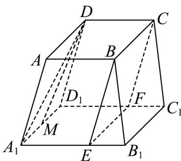

> [!faq]- 《专题17 空间直线、平面的平行-面面平行（高效培优期中专项训练）数学人教A版高一必修第二册》官方解析
>
> > [!success]- **【答案】** (1)证明见解析 (2) $\frac{7}{8}$
>
> > [!note]- **【解析】**
> > （1）∵正四棱台 $ABCD-A_{1}B_{1}C_{1}D_{1}$ 中， $2A_{1}B_{1}=3AB$ ， $A_{1}B_{1}\parallel AB$
> >
> > $\therefore AB=\frac{2}{3}A_{1}B_{1}$ ，又 $\because A_{1}E=\frac{2}{3}A_{1}B_{1}$
> >
> > $\therefore AB = A_{1}E$ ，∴四边形 $AA_{1}EB$ 为平行四边形，
> >
> > $\therefore AA_{1} \parallel BE$ ，又∵ $AA_{1} \not\subset$ 平面BCFE， $BE \subset$ 平面BCFE，
> >
> > $\therefore AA_{1} \parallel$ 平面 BCFE，
> >
> > $\because AD \parallel BC, AD \notin$ 平面 $BCFE, BC \subset$ 平面 $BCFE, \therefore AD \parallel$ 平面 $BCFE$
> >
> > 又∵ $AA_{1}\cap AD=A$ ， $AA_{1}\subset$ 平面 $ADD_{1}A_{1}$ ， $AD\subset$ 平面 $ADD_{1}A_{1}$
> >
> > ∴平面 $ADD_{1}A_{1} \parallel$ 平面 BCFE
> >
> > $\because A_{1}D\subset$ 平面 $ADD_{1}A_{1}$ ， $\therefore A_{1}D\parallel$ 平面BCFE.
> >
> > 
> >
> > (2) 在等腰梯形 $ADD_{1}A_{1}$ 中作 DM // $AA_{1}$ 交 $A_{1}D_{1}$ 于点 M，
> >
> > 由（1）知， $AA_{1} \parallel BE$ ，∴ $BE \parallel DM$ ，
> >
> > $\therefore \angle MDD_{1}$ 就是异面直线 $DD_{1}$ 与 $EB$ 所成的角，
> >
> > $$
> > .. D D _ {1} = A D = 2 \quad 2 A _ {1} D _ {1} = 3 A D
> > $$
> >
> > $\therefore \triangle MDD_{1}$ 中， $DM = DD_{1} = 2$ ， $MD_{1} = 1$
> >
> > $$
> > \therefore \cos \angle M D D _ {1} = \frac {D M ^ {2} + D D _ {1} ^ {2} - M D _ {1} ^ {2}}{2 D M \cdot D D _ {1}} = \frac {7}{8},
> > $$
> >
> > ∴异面直线 $DD_{1}$ 与EB所成的角的余弦值为 $\frac{7}{8}$ ·
