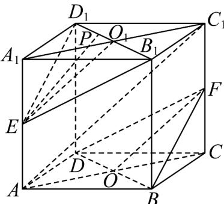

> [!faq]- 《专题17 空间直线、平面的平行-面面平行（高效培优期中专项训练）数学人教A版高一必修第二册》官方解析
>
> > [!success]- **【答案】** (1)证明见解析 (2)证明见解析
>
> > [!note]- **【解析】**
> > （1）（1）如图，连接AC交BD于点O，连接FO.
> >
> > ∵F为 $CC_{1}$ 的中点，O为AC的中点，
> >
> > ∴FO为 $\triangle ACC_{1}$ 的中位线，
> >
> > $\therefore FO \parallel AC_{1}$ .
> >
> > 又∵ $FO \subset$ 平面 BDF ， $AC_{1} \not\subset$ 平面 BDF
> >
> > $\therefore AC_{1} \parallel$ 平面 $BDF$
> >
> > 
> >
> > (2) 连接 $ED_{1}$ ， $EB_{1}$ ，连接 $A_{1}C_{1}$ 交 $B_{1}D_{1}$ 于点 $O_{1}$ ，连接 $EO_{1}$ ，如图·在正方体 $ABCD - A_{1}B_{1}C_{1}D_{1}$ 中， $BD \parallel B_{1}D_{1}$ ，
> >
> > $\because B_{1}D_{1}\not\subset$ 平面BDF， $BD\subset$ 平面BDF，
> >
> > $\therefore B_{1}D_{1}\parallel$ 平面 BDF.
> >
> > 又 $EO_{1}$ 为 $\triangle AA_{1}C_{1}$ 的中位线，
> >
> > $\therefore EO_{1}\parallel AC_{1}$
> >
> > $\because AC_{1} \parallel$ 平面 BDF， $EO_{1} \not\subset$ 平面 BDF，
> >
> > $\therefore EO_{1}\parallel$ 平面 BDF·
> >
> > 又∵ $EO_{1}\subset$ 平面 $B_{1}D_{1}E$ ， $B_{1}D_{1}\subset$ 平面 $B_{1}D_{1}E$ ， $EO_{1}\cap B_{1}D_{1}=O_{1}$
> >
> > ∴平面 $B_{1}D_{1}E\|$ 平面BDF·
> >
> > $\because PE \subset$ 平面 $B_{1}D_{1}E$
> >
> > ∴ PE ∥ 平面 BDF ·
