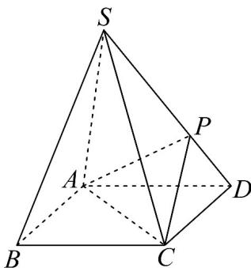

<!-- question-source:start -->
38. 如图所示正四棱锥 $S - ABCD$ ， $SA = SB = SC = SD = 2, AB = \sqrt{2}$ ， $P$ 为侧棱 $SD$ 上的点。且 $SP = 3PD$ ，求：

(1)正四棱锥 S-ABCD 的表面积；

(2)侧棱 $SC$ 上是否存在一点 $E$ ，使得 $BE //$ 平面 $PAC$ 。若存在，求 $\frac{SE}{EC}$ 的值；若不存在，试说明理由。
<!-- question-source:end -->

![[高中/课堂同步/题库/人教A版高中数学同步讲义(2026)/02_必修第二册/期中专项训练+期中模拟卷/专题17 空间直线、平面的平行-面面平行（高效培优期中专项训练）数学人教A版高一必修第二册/考点_07_面面平行证明面面平行/questions/answers/Q00077353A1.md]]
