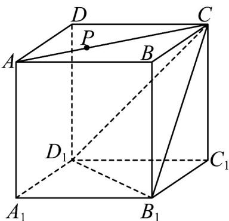

<!-- question-source:start -->
39. 在一次通用技术实践课上，木工小组需要将正方体木块截去一角，要求截面经过面对角线 $AC$ 上的点 $P$ （如图），且与平面 $B_{1}CD_{1}$ 平行，已知 $AA_{1} = 10\mathrm{cm}$ ， $AP = 6\mathrm{cm}$ ，则截面面积等于 $\underline{\hspace{2cm}}$ cm².

<!-- question-source:end -->

![[高中/课堂同步/题库/人教A版高中数学同步讲义(2026)/02_必修第二册/期中专项训练+期中模拟卷/专题17 空间直线、平面的平行-面面平行（高效培优期中专项训练）数学人教A版高一必修第二册/考点_07_面面平行证明面面平行/questions/answers/Q00077354A1.md]]
