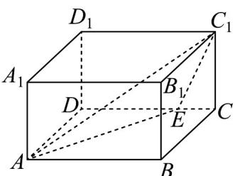
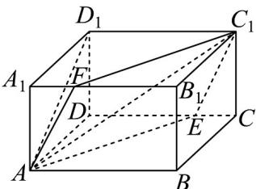
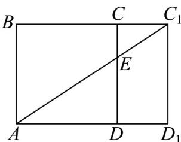
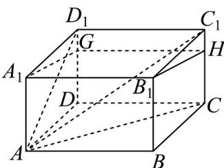
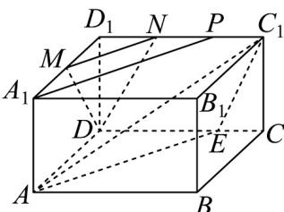

> [!faq]- 《专题17 空间直线、平面的平行-面面平行（高效培优期中专项训练）数学人教A版高一必修第二册》官方解析
>
> > [!success]- **【答案】**  A. 长方体外接球的表面积为 $14\pi$ <!-- source-part:2 pages:51-55 --> B. 过 $A, E, C_1$ 三点的平面截长方体 $ABCD - A_1B_1C_1D_1$ 所得截面的周长的最小值为 $6\sqrt{2}$ C. 在棱 $DD_{1}$ 上存在相应的点 $G$ , 使得 $A_1G //$ 平面 $AEC_{1}$ D．若 $CE=\frac{1}{3}CD$ ，点 F 在四边形 $A_{1}B_{1}C_{1}D_{1}$ （包括边界）上运动，且 $DF//$ 平面 $AEC_{1}$ ，则 $DF$ 的最小值为 $\frac{\sqrt{6}}{2}$
>
> > [!note]- **【解析】**
> > A选项：由已知，长方体体对角线长 $BD_{1}=\sqrt{3^{3}+2^{2}+1^{2}}=\sqrt{14}=2R$
> >
> > 其中， $R$ 为外接球的半径，则 $R = \frac{\sqrt{14}}{2}$ ，外接球的表面积 $S = 4\pi R^2 = 4\pi \times \frac{14}{4} = 14\pi$ ，A选项正确；
> >
> > B选项：
> >
> > 
> >
> > 在长方体的棱 $A_{1}B_{1}$ 上取点 F，满足 $A_{1}F = CE$ ，连接 $C_{1}F$ 、AF，
> >
> > 因为 $AA_{1} = CC_{1},\angle AA_{1}F = \angle C_{1}CE,A_{1}F = CE$ ，则 $AF = C_1E$ ，同理可证 $C_1F = AE$
> >
> > 则四边形 $AEC_{1}F$ 为平行四边形，是过 $A, E, C_{1}$ 三点的平面截长方体 $ABCD - A_{1}B_{1}C_{1}D_{1}$ 所得截面，则周长 $L = 2(AE + EC_{1})$ ，
> >
> > 将侧面 ABCD 与 $CDC_{1}D_{1}$ 沿着 CD 展开，可得侧面展开图如下图所示，
> >
> > 
> >
> > 当 $A, E$ ，三点共线时有最小值，
> >
> > $$
> > A E + E C _ {1}
> > $$
> >
> > 此时 $L_{\mathrm{min}} = 2(AE + EC_1) = 2 \times \sqrt{3^2 + 3^2} = 6\sqrt{2}$ ，B选项正确；
> >
> > C 选项中，假设 $A_{1}G / /$ 平面 $AEC_{1}$ ，若 $E$ 与 $C$ 与重合，在 $CC_{1}$ 上取点 $H$ ，满足 $D_{1}G = B_{1}H$
> >
> > 则 $A_{1}G \parallel B_{1}H$ ，由图可知， $A_{1}G$ 的平行线 $B_{1}H$ 与平面 $AEC_{1}$ 相交，假设不成立，C选项错误；
> >
> > 
> >
> > $^{D}$ 选项：E 点为 CD 的一个三等分点，则在 $D_{1}C_{1}$ 上取三等分点 N，在 $D_{1}A_{1}$ 上取二等分点 M，
> >
> > 因为 $NC_{1} \parallel DE, NC_{1} = DE$ ，所以 $DN \parallel EC_{1}$
> >
> > 又因为 $DN \notin$ 平面 $AEC_{1}$ ， $EC_{1} \subset$ 平面 $AEC_{1}$ ，所以 $DN //$ 平面 $AEC_{1}$
> >
> > 在 $D_{1}C_{1}$ 上取靠近 $C_{1}$ 的三等分点 $P$ ，
> >
> > 连接 $A_{1}P$ ，因为 $AA_{1} \parallel PE, AA_{1} = PE$ ，所以 $A_{1}P \parallel AE$ ，
> >
> > 由等分关系， $MN\parallel A_1P$ ，所以 $MN\parallel AE$
> >
> > $MN\not\subset$ 平面 $AEC_{1}$ ， $AE\subset$ 平面 $AEC_{1}$
> >
> > 所以 $MN / /$ 平面 $AEC_{1}$
> >
> > 又 $MN \cap ND = N$ ， $MN, ND \subset$ 平面 $MND$
> >
> > 所以平面 MDN // 平面 $AEC_{1}$ ，结合题意可知 F 的轨迹为 MN·
> >
> > 又因为 $DD_{1} = D_{1}M = D_{1}N = 1$ ，所以 $DM = DN = \sqrt{2}$ ， $MN = \frac{1}{2} A_1P = \frac{1}{2} AE = \frac{1}{2}\times \sqrt{2^2 + 2^2} = \sqrt{2}$
> >
> > 所以 $DF$ 的最小值是等边三角形 $DMN$ 的高线， $DF_{\min} = \sqrt{2} \times \frac{\sqrt{3}}{2} = \frac{\sqrt{6}}{2}$ ，D选项正确·
> >
> > 
> >
> > 故选 **ABD**
