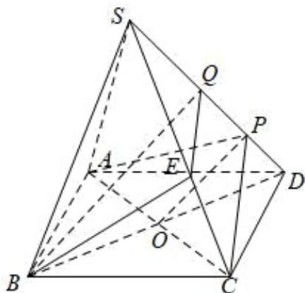

> [!faq]- 《专题17 空间直线、平面的平行-面面平行（高效培优期中专项训练）数学人教A版高一必修第二册》官方解析
>
> > [!success]- **【答案】** (1) $2\sqrt{7} + 2$ ； (2)在侧棱 $SC$ 上存在一点 $E$ ，使 $BE //$ 平面 $PAC$ ，满足 $\frac{SE}{EC} = 2$
>
> > [!note]- **【解析】**
> > （1）∵正四棱锥 S-ABCD 中，SA=SB=SC=SD=2， $AB=\sqrt{2}$
> >
> > 侧面的高 $h = \sqrt{2^2 - (\frac{\sqrt{2}}{2})^2} = \frac{\sqrt{14}}{2}$
> >
> > ∴ 正四棱锥 $S - ABCD$ 的表面积 $S = 4 \times \frac{1}{2} \times \sqrt{2} \times \frac{\sqrt{14}}{2} + \sqrt{2} \times \sqrt{2} = 2\sqrt{7} + 2$
> >
> > (2)
> >
> > 
> >
> > 在侧棱 $SC$ 上存在一点 $E$ ，使 $BE //$ 平面 $PAC$ ，满足 $\frac{SE}{EC} = 2$
> >
> > 理由如下：
> >
> > 取 $SD$ 中点为 $Q$ ，因为 $SP = 3PD$ ，则 $PQ = PD$
> >
> > 过 $Q$ 作 $PC$ 的平行线交 $SC$ 于 $E$ ，连接 $BQ$ ， $BE$
> >
> > 在 $\triangle BDQ$ 中，有 $BQ // PO$
> >
> > ∵ $PO \subset$ 平面 PAC ， $BQ \not\subset$ 平面 PAC ， ∴ $BQ //$ 平面 PAC ，
> >
> > 由于 $\frac{SQ}{QP} = 2$ ， $\therefore \frac{SE}{EC} = \frac{SQ}{QP} = 2$
> >
> > 又由于QE//PC，
> >
> > $PC \subset$ 平面 PAC， $QE \not\subset$ 平面 PAC， $\therefore QE //$ 平面 PAC，
> >
> > ∵ $BQ \cap QE = Q$ ，∴ 平面 $BEQ //$ 平面 PAC，得 $BE //$ 平面 PAC，
