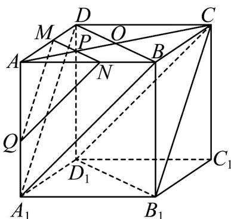

> [!faq]- 《专题17 空间直线、平面的平行-面面平行（高效培优期中专项训练）数学人教A版高一必修第二册》官方解析
>
> > [!success]- **【答案】** $36 \sqrt{3}$
>
> > [!note]- **【解析】**
> > 如图，连接 BD 交 AC 于点 O，连接 $A_{1}D$ 、 $A_{1}B$ 。
> >
> > 
> >
> > 因为 $BB_{1} // DD_{1}$ 且 $BB_{1} = DD_{1}$ ，故四边形 $BB_{1}D_{1}D$ 为平行四边形，所以， $BD // B_{1}D_{1}$ ，因为 $BD \notin$ 平面 $B_{1}CD_{1}$ ， $B_{1}D_{1} \subset$ 平面 $B_{1}CD_{1}$ ，所以， $BD //$ 平面 $B_{1}CD_{1}$ ，
> >
> > 同理可证 $A_{1}B / /$ 平面 $B_{1}CD_{1}$
> >
> > 因为 $A_{1}B \cap BD = B$ ， $A_{1}B$ 、 $BD \subset$ 平面 $A_{1}BD$ ，所以，平面 $A_{1}BD //$ 平面 $B_{1}CD_{1}$
> >
> > 故截面平行于平面 $A_{1}BD$ .
> >
> > 过点 P 作与 BD 平行的直线分别交 AD 、 AB 于点 M 、 N ，在 $AA_{1}$ 上取点 Q 使 AQ = AM .
> >
> > $$
> > \because A Q = A M, \therefore \frac {A Q}{A A _ {1}} = \frac {A M}{A D}, \therefore \triangle A Q M \sim \triangle A A _ {1} D, \therefore Q M / / D A _ {1}.
> > $$
> >
> > 因为 $QM \notin$ 平面 $A_{1}BD$ ， $A_{1}D \subset$ 平面 $A_{1}BD$ ，所以， $QM \parallel$ 平面 $A_{1}BD$
> >
> > 又因为 $MN // DB$ ， $MN \notin$ 平面 $A_{1}BD$ ， $BD \subset$ 平面 $A_{1}BD$ ，所以， $MN //$ 平面 $A_{1}BD$
> >
> > 因为 $MN \cap QM = M$ ，MN、 $QM \subset$ 平面 MNQ，所以，平面 $MNQ \parallel$ 平面 $A_{1}BD$ ，
> >
> > 易得 $\triangle MNQ \sim \triangle DBA_{1}$ ，故 $\frac{S_{\triangle MNQ}}{S_{\triangle DBA_{1}}} = \left(\frac{MN}{DB}\right)^{2} = \left(\frac{AP}{AO}\right)^{2} = \left(\frac{6}{5\sqrt{2}}\right)^{2} = \frac{18}{25}$ ，
> >
> > 因为 $A_{1}B = \sqrt{AB^{2} + AA_{1}^{2}} = \sqrt{10^{2}\times 2} = 10\sqrt{2}$
> >
> > 易知 $\triangle A_{1}BD$ 是边长为 $10\sqrt{2}$ 的等边三角形，所以， $S_{\triangle A_1BD} = \frac{1}{2} \times (10\sqrt{2})^2 \times \sin 60^\circ = 50\sqrt{3}$
> >
> > 因此， $S_{\triangle MNQ} = \frac{18}{25} S_{\triangle A_1BD} = \frac{18}{25}\times 50\sqrt{3} = 36\sqrt{3}\left(\mathrm{cm}^2\right).$
> >
> > 故答案为： $36 \sqrt{3}$
