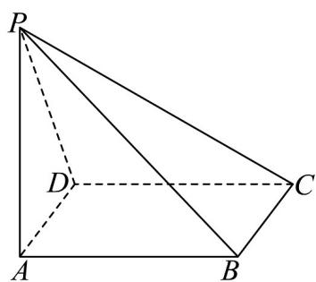

<!-- question-source:start -->
1. 如图所示，在四棱锥 $P - ABCD$ 中，底面 $ABCD$ 是边长为 2 的菱形， $\angle BAD = 60^{\circ}$ ，侧棱 $PA \perp$ 平面 $ABCD$ 且 $PA = \sqrt{3}$ ，求：

(1)三棱锥 P-ABD 的体积；

(2)二面角 $P - BD - A$ 的大小.
<!-- question-source:end -->

![[高中/课堂同步/题库/人教A版高中数学同步讲义(2026)/02_必修第二册/期中专项训练+期中模拟卷/专题19 空间直线、平面的垂直-线面垂直（高效培优期中专项训练）数学人教A版高一必修第二册/专题19_空间直线_平面的垂直_线面垂直/questions/answers/Q00077355A1.md]]
