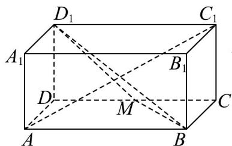
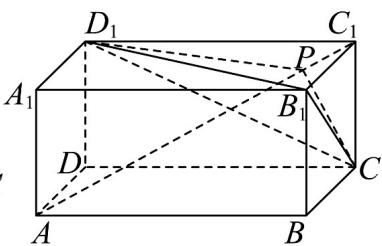

<!-- question-source:start -->
2. 如图，长方体 $ABCD - A_1B_1C_1D_1$ 中， $AB = m$ ， $AD = AA_1 = 1$ ，点 $M$ 是棱 $CD$ 的中点。

(1)求异面直线 $B_{1}C$ 与 $AC_{1}$ 所成的角的大小；

(2)当实数 $m = \sqrt{2}$ ，证明：直线 $AC_{1}$ 与平面 $BMD_{1}$ 垂直；

(3)若 $m = 2$ .设 $P$ 是线段 $AC_{1}$ 上的一点（不含端点），满足 $\frac{AP}{AC_1} = \lambda$ ，求 $\lambda$ 的值，使得三棱锥 $B_{1} - CD_{1}C_{1}$ 与三棱锥 $B_{1} - CD_{1}P$ 的体积相等.
<!-- question-source:end -->

![[高中/课堂同步/题库/人教A版高中数学同步讲义(2026)/02_必修第二册/期中专项训练+期中模拟卷/专题19 空间直线、平面的垂直-线面垂直（高效培优期中专项训练）数学人教A版高一必修第二册/专题19_空间直线_平面的垂直_线面垂直/questions/answers/Q00077356A1.md]]
