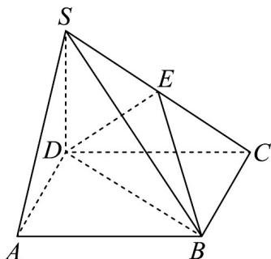

<!-- question-source:start -->
3. 如图，四棱锥 $S - ABCD$ 的底面是边长为 2 的正方形， $SD$ 垂直于底面 $ABCD$ ， $E$ 为 $SC$ 的中点， $SD = AD$ ， $O$ 为 $BD$ 中点。

(1)求证： $SA / /$ 平面 $BDE$ ；

(2)求证： $AC\perp$ 平面SBD
<!-- question-source:end -->

![[高中/课堂同步/题库/人教A版高中数学同步讲义(2026)/02_必修第二册/期中专项训练+期中模拟卷/专题19 空间直线、平面的垂直-线面垂直（高效培优期中专项训练）数学人教A版高一必修第二册/专题19_空间直线_平面的垂直_线面垂直/questions/answers/Q00077357A1.md]]
