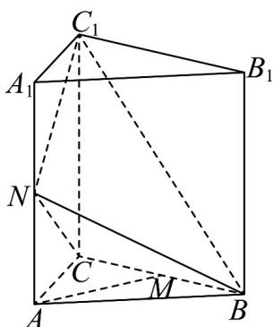

<!-- question-source:start -->
4．如图，在三棱柱 $ABC-A_{1}B_{1}C_{1}$ 中， $AA_{1}\perp$ 底面 $ABC,\angle ACB=90^{\circ},AA_{1}=2AC,N,M$ 分别为 $AA_{1},BC$ 的中点，求证：

(1) $AM / /$ 平面 $BNC_{1}$

(2) $NC_{1}\perp$ 平面NBC.
<!-- question-source:end -->

![[高中/课堂同步/题库/人教A版高中数学同步讲义(2026)/02_必修第二册/期中专项训练+期中模拟卷/专题19 空间直线、平面的垂直-线面垂直（高效培优期中专项训练）数学人教A版高一必修第二册/专题19_空间直线_平面的垂直_线面垂直/questions/answers/Q00077358A1.md]]
