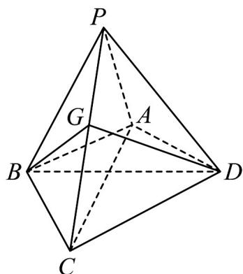

<!-- question-source:start -->
6. 如图，在四棱锥 $P - ABCD$ 中， $PA \perp$ 面 $ABCD$ ， $AB = BC = 2$ ， $AD = CD = \sqrt{7}$ ， $PA = \sqrt{3}$ ， $\angle ABC = 120^{\circ}$ ， $G$ 为线段 $PC$ 上的点。

(1)证明： $BD \perp$ 面 APC；

(2)若 $G$ 满足 $PC \perp$ 面 $BGD$ ，求 $\frac{PG}{GC}$ 的值.
<!-- question-source:end -->

![[高中/课堂同步/题库/人教A版高中数学同步讲义(2026)/02_必修第二册/期中专项训练+期中模拟卷/专题19 空间直线、平面的垂直-线面垂直（高效培优期中专项训练）数学人教A版高一必修第二册/专题19_空间直线_平面的垂直_线面垂直/questions/answers/Q00077360A1.md]]
