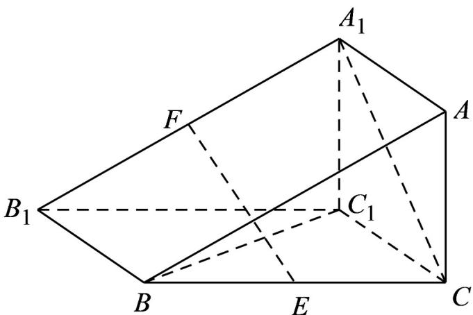

<!-- question-source:start -->
8. 若图，三棱柱 $ABC - A_{1}B_{1}C_{1}$ 的侧面 $BCC_{1}B_{1}$ 是平行四边形， $BC_{1} \perp CC_{1}$ ， $BC_{1} \wedge A_{1}C$ ，且 $E$ 、 $F$ 分别是 $BC$ 、 $A_{1}B_{1}$ 的中点。

(1)求证： $EF \parallel$ 平面 $A_{1}C_{1}CA$ ；

(2)在线段 $AB$ 上是否存在点 $P$ ，使得 $BC_{1} \perp$ 平面 $EFP$ ？若存在，求出 $\frac{AP}{AB}$ 的值；若不存在，请说明理由·
<!-- question-source:end -->

![[高中/课堂同步/题库/人教A版高中数学同步讲义(2026)/02_必修第二册/期中专项训练+期中模拟卷/专题19 空间直线、平面的垂直-线面垂直（高效培优期中专项训练）数学人教A版高一必修第二册/专题19_空间直线_平面的垂直_线面垂直/questions/answers/Q00077361A1.md]]
