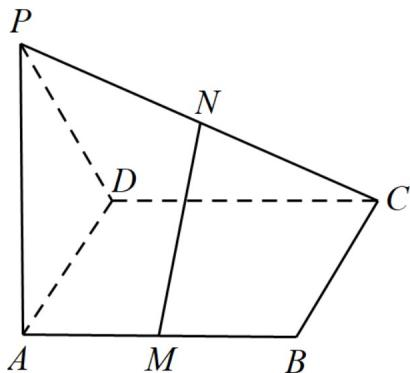

<!-- question-source:start -->
9. 如图，四边形 $ABCD$ 为矩形， $PA \perp$ 平面 $ABCD$ ， $M$ ， $N$ 分别是 $AB$ ， $PC$ 的中点。

(1)求证： $MN / /$ 平面PAD；

(2)试确定当 $\triangle PAD$ 中 $PA$ 与 $AD$ 满足什么关系时， $MN^{\perp}$ 平面 $PCD$ ？并说明理由。
<!-- question-source:end -->

![[高中/课堂同步/题库/人教A版高中数学同步讲义(2026)/02_必修第二册/期中专项训练+期中模拟卷/专题19 空间直线、平面的垂直-线面垂直（高效培优期中专项训练）数学人教A版高一必修第二册/专题19_空间直线_平面的垂直_线面垂直/questions/answers/Q00077362A1.md]]
