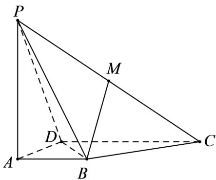

<!-- question-source:start -->
10．如图，在四棱锥 P-ABCD 中， $AB^{\perp}AD$ ， $CD^{\perp}AD$ ， $PA^{\perp}$ 平面 ABCD，PA = AD = CD = 2AB = 2，M 为 PC 的中点．

(1) 求证： $BM \parallel /$ 平面 PAD .

(2) 平面 PAD 内是否存在一点 N，使 $MN^{\perp}$ 平面 PBD？若存在，确定点 N 的位置；若不存在，请说明理由。
<!-- question-source:end -->

![[高中/课堂同步/题库/人教A版高中数学同步讲义(2026)/02_必修第二册/期中专项训练+期中模拟卷/专题19 空间直线、平面的垂直-线面垂直（高效培优期中专项训练）数学人教A版高一必修第二册/专题19_空间直线_平面的垂直_线面垂直/questions/answers/Q00077363A1.md]]
