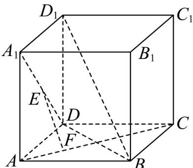

<!-- question-source:start -->
11. 如图所示，在正方体 $ABCD - A_{1}B_{1}C_{1}D_{1}$ 中， $EF$ 与 $AC$ ， $A_{1}D$ 都垂直相交，垂足分别是点 $F$ 、点 $E\cdot$

(1)求证： $EF \perp$ 平面 $AB_{1}C$ ；

(2)求证： $EF//BD_{1}$ .
<!-- question-source:end -->

![[高中/课堂同步/题库/人教A版高中数学同步讲义(2026)/02_必修第二册/期中专项训练+期中模拟卷/专题19 空间直线、平面的垂直-线面垂直（高效培优期中专项训练）数学人教A版高一必修第二册/专题19_空间直线_平面的垂直_线面垂直/questions/answers/Q00077364A1.md]]
