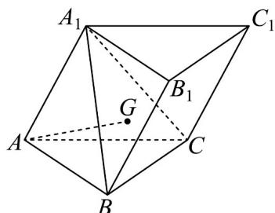

<!-- question-source:start -->
12．已知三棱柱 $ABC-A_{1}B_{1}C_{1}$ 中，底面 VABC 是边长为 2 的正三角形，G 为 $\triangle A_{1}BC$ 的重心，

$$
\angle A _ {1} A B = \angle A _ {1} A C = 6 0 ^ {\circ}
$$

(1)求证： $B_{1}B^{\wedge}BC$

(2)已知 $A_{1}A = 2, P \in$ 平面 $ABC$ ，且 $C_{1}P \perp$ 平面 $A_{1}BC$ 。求证： $AG // C_{1}P$
<!-- question-source:end -->

![[高中/课堂同步/题库/人教A版高中数学同步讲义(2026)/02_必修第二册/期中专项训练+期中模拟卷/专题19 空间直线、平面的垂直-线面垂直（高效培优期中专项训练）数学人教A版高一必修第二册/专题19_空间直线_平面的垂直_线面垂直/questions/answers/Q00077365A1.md]]
