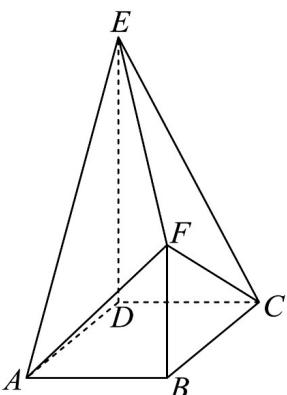

<!-- question-source:start -->
13．如图，在多面体 $ABCDEF$ 中，四边形 $ABCD$ 是正方形， $DE \perp$ 平面 $ABCD$ ， $BF \perp$ 平面 $ABCD$ ， $DE = 2BF = 2AB$ ．

(1)求证：平面 $ABF / /$ 平面 $CDE$ ；

(2)若 $AB = 2$ ，求多面体 $ABCDEF$ 的体积.
<!-- question-source:end -->

![[高中/课堂同步/题库/人教A版高中数学同步讲义(2026)/02_必修第二册/期中专项训练+期中模拟卷/专题19 空间直线、平面的垂直-线面垂直（高效培优期中专项训练）数学人教A版高一必修第二册/专题19_空间直线_平面的垂直_线面垂直/questions/answers/Q00077366A1.md]]
