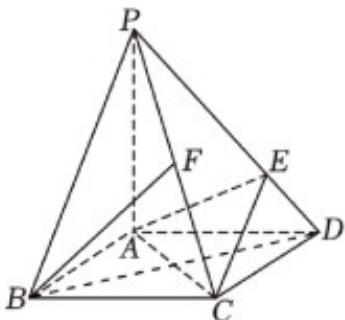

<!-- question-source:start -->
20. 如图所示，在底面是菱形的四棱锥 $P - ABCD$ 中， $\angle ABC = 60^{\circ}$ ， $PA = AC = 1$ ， $PB = PD = \sqrt{2}$ ，点 $E$ 在 $PD$ 上，且 $PE:ED = 2:1$ .

(1)证明： $BD \perp PC$ ；

(2)求点 A 到平面 PBD 的距离；

(3) $F$ 是棱 $PC$ 的中点，证明： $BF \parallel$ 平面 $AEC$ .
<!-- question-source:end -->

![[高中/课堂同步/题库/人教A版高中数学同步讲义(2026)/02_必修第二册/期中专项训练+期中模拟卷/专题19 空间直线、平面的垂直-线面垂直（高效培优期中专项训练）数学人教A版高一必修第二册/专题19_空间直线_平面的垂直_线面垂直/questions/answers/Q00077371A1.md]]
