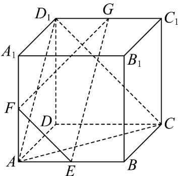

<!-- question-source:start -->
21. 已知正方体 $ABCD - A_1B_1C_1D_1$ 中，点 $E, F, G$ 分别为棱 $AB, AA_1, C_1D_1$ 的中点，给出下列四个结论：

其中不正确结论是（ ）

A. 直线 $FG$ 与平面 $ACD_{1}$ 相交；

B. $B_{1}D \perp$ 平面 $EFG$ ;

C. 若 $AB = 1$ ，则点 $D$ 到平面 $ACD_{1}$ 的距离为 $\frac{\sqrt{3}}{3}$ ；

D．该正方体的棱所在直线与平面 EFG 所成的角都相等．
<!-- question-source:end -->

![[高中/课堂同步/题库/人教A版高中数学同步讲义(2026)/02_必修第二册/期中专项训练+期中模拟卷/专题19 空间直线、平面的垂直-线面垂直（高效培优期中专项训练）数学人教A版高一必修第二册/专题19_空间直线_平面的垂直_线面垂直/questions/answers/Q00077372A1.md]]
