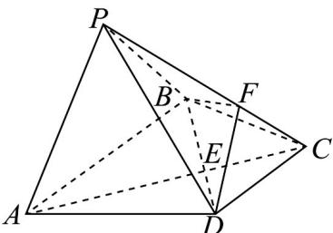

<!-- question-source:start -->
23. 如图，在四棱锥 $P - ABCD$ 中，底面 $ABCD$ 是等腰梯形， $AB // CD$ ， $AB = 2CD$ ， $AC \cap BD = E$ ，点 $F$ 在棱 $PC$ 上，且 $PF = 2FC$ .

(1)证明： $PA \parallel$ 平面 BDF；

(2)若 $BC = DC = 6$ ，三棱锥 $B - CDF$ 的体积为6，求点 $P$ 到平面ABCD的距离.
<!-- question-source:end -->

![[高中/课堂同步/题库/人教A版高中数学同步讲义(2026)/02_必修第二册/期中专项训练+期中模拟卷/专题19 空间直线、平面的垂直-线面垂直（高效培优期中专项训练）数学人教A版高一必修第二册/专题19_空间直线_平面的垂直_线面垂直/questions/answers/Q00077374A1.md]]
