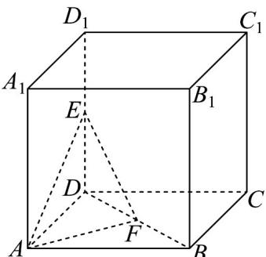

<!-- question-source:start -->
24. 如图，在棱长为 2 的正方体 $ABCD - A_1B_1C_1D_1$ 中， $E$ ， $F$ 分别为线段 $DD_1$ ， $BD$ 的中点·

(1)求点 $D$ 到平面 $AEF$ 的距离；

(2)求直线 EF 与平面 ABCD 所成的角的正弦值.
<!-- question-source:end -->

![[高中/课堂同步/题库/人教A版高中数学同步讲义(2026)/02_必修第二册/期中专项训练+期中模拟卷/专题19 空间直线、平面的垂直-线面垂直（高效培优期中专项训练）数学人教A版高一必修第二册/专题19_空间直线_平面的垂直_线面垂直/questions/answers/Q00077375A1.md]]
