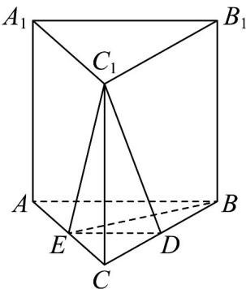

<!-- question-source:start -->
25. 如图，在直三棱柱 $ABC - A_{1}B_{1}C_{1}$ 中，底面 $ABC$ 为直角三角形， $AB = BC$ ， $D$ ， $E$ 分别为 $BC$ ， $AC$ 的中点。求证：

(1) $A_{1}B_{1}\parallel$ 平面 $DEC_{1}$ ;

(2)若 $A_{1}A = 4, AB = 2$ ，求点 $E$ 到平面 $A_{1}BC$ 的距离。
<!-- question-source:end -->

![[高中/课堂同步/题库/人教A版高中数学同步讲义(2026)/02_必修第二册/期中专项训练+期中模拟卷/专题19 空间直线、平面的垂直-线面垂直（高效培优期中专项训练）数学人教A版高一必修第二册/专题19_空间直线_平面的垂直_线面垂直/questions/answers/Q00077376A1.md]]
