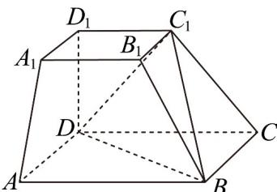

<!-- question-source:start -->
26．如图，在四棱台 $ABCD-A_{1}B_{1}C_{1}D_{1}$ 中，底面 ABCD 是正方形， $D_{1}D \perp$ 平面 ABCD ， $D_{1}D = 2$ ，AB = 4， $A_{1}B_{1}=2$

(1)求证： $A_{1}A//$ 平面 $C_{1}BD$ ；

(2)求直线 $A_{1}A$ 到平面 $C_1BD$ 的距离；

(3)若点 $P$ 是平面ABCD内的动点，且满足 $BD \perp B_{1}P$ ，设直线 $D_{1}P$ 与平面ABCD所成角为 $\theta$ ，求 $\tan \theta$ 的最大值．
<!-- question-source:end -->

![[高中/课堂同步/题库/人教A版高中数学同步讲义(2026)/02_必修第二册/期中专项训练+期中模拟卷/专题19 空间直线、平面的垂直-线面垂直（高效培优期中专项训练）数学人教A版高一必修第二册/专题19_空间直线_平面的垂直_线面垂直/questions/answers/Q00077377A1.md]]
