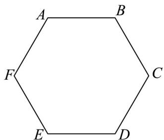
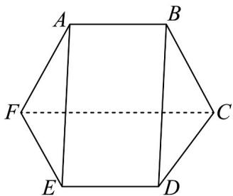

<!-- question-source:start -->
28. 如图，将边长为 $^{2}$ 的正六边形 ABCDEF 沿对角线 CF 折起，记二面角 A-FC-E 的大小为 $\theta(0<\theta<\pi)$ ，连接 AE，BD 构成多面体 AB-CDEF。

(1)求证： $CF \parallel$ 平面 ABDE；

(2)问当 $\theta$ 为何值时，直线 $CF$ 到平面 $ABDE$ 的距离等于 $\frac{\sqrt{3}}{2}$ ？

(3)在 $(2)$ 的条件下，求多面体AB-CDEF的表面积.
<!-- question-source:end -->

![[高中/课堂同步/题库/人教A版高中数学同步讲义(2026)/02_必修第二册/期中专项训练+期中模拟卷/专题19 空间直线、平面的垂直-线面垂直（高效培优期中专项训练）数学人教A版高一必修第二册/专题19_空间直线_平面的垂直_线面垂直/questions/answers/Q00077378A1.md]]
