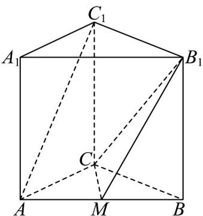

<!-- question-source:start -->
29. 如图，在直三棱柱 $ABC - A_{1}B_{1}C_{1}$ 中， $CA = CB = 2$ ， $AB = 2\sqrt{2}$ ， $AA_{1} = 3$ ， $M$ 为 $AB$ 的中点。

(1)证明： $AC_{1} / /$ 平面 $B_{1}CM$ ；

(2)求直线 $AC_{1}$ 到平面 $B_{1}CM$ 的距离.
<!-- question-source:end -->

![[高中/课堂同步/题库/人教A版高中数学同步讲义(2026)/02_必修第二册/期中专项训练+期中模拟卷/专题19 空间直线、平面的垂直-线面垂直（高效培优期中专项训练）数学人教A版高一必修第二册/专题19_空间直线_平面的垂直_线面垂直/questions/answers/Q00077379A1.md]]
