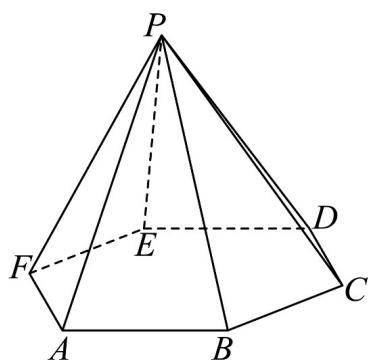

<!-- question-source:start -->
30. 如图，在正六棱锥 $P - ABCDEF$ 中， $AB = 2, PA = \sqrt{13}$

(1)求棱锥的高和斜高；

(2)求直线 DE 到平面 PAB 的距离；

(3)若球 O 是正六棱锥 P-ABCDEF 的内切球，以底面正六边形 ABCDEF 的中心为圆心，以内切球半径为半径的圆面沿垂直于底面的方向向上平移形成正六棱锥 P-ABCDEF 的内接几何体，求该几何体的侧面积．
<!-- question-source:end -->

![[高中/课堂同步/题库/人教A版高中数学同步讲义(2026)/02_必修第二册/期中专项训练+期中模拟卷/专题19 空间直线、平面的垂直-线面垂直（高效培优期中专项训练）数学人教A版高一必修第二册/专题19_空间直线_平面的垂直_线面垂直/questions/answers/Q00077380A1.md]]
