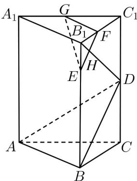

<!-- question-source:start -->
34. 如图在直三棱柱 $ABC - A_{1}B_{1}C_{1}$ 中， $\angle ABC = 90^{\circ}$ ， $BC = 2$ ， $CC_{1} = 4$ ， $E$ 是 $BB_{1}$ 上的一点，且 $EB_{1} = 1$ ， $D$ 、 $F$ 、 $G$ 分别是 $CC_{1}$ 、 $B_{1}C_{1}$ 、 $A_{1}C_{1}$ 的中点， $EF$ 与 $B_{1}D$ 相交于 $H$ 。

(1)求证： $B_{1}D\perp$ 平面ABD；

(2)求平面 $EGF$ 与平面 $ABD$ 的距离.
<!-- question-source:end -->

![[高中/课堂同步/题库/人教A版高中数学同步讲义(2026)/02_必修第二册/期中专项训练+期中模拟卷/专题19 空间直线、平面的垂直-线面垂直（高效培优期中专项训练）数学人教A版高一必修第二册/专题19_空间直线_平面的垂直_线面垂直/questions/answers/Q00077381A1.md]]
