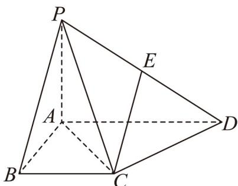

<!-- question-source:start -->
37. 如图，在四棱锥 $P - ABCD$ 中， $PA \perp$ 平面 $ABCD$ ， $E$ 为 $PD$ 的中点， $AD // BC$ ， $\angle BAD = 90^\circ$ ， $PA = AB = BC = 1$ ， $AD = 2$ .

<!-- source-part:2 pages:51-62 -->

(1)求证： $DC\perp$ 平面PAC；

(2)求直线 EC 与平面 PAC 所成角的正弦值.
<!-- question-source:end -->

![[高中/课堂同步/题库/人教A版高中数学同步讲义(2026)/02_必修第二册/期中专项训练+期中模拟卷/专题19 空间直线、平面的垂直-线面垂直（高效培优期中专项训练）数学人教A版高一必修第二册/专题19_空间直线_平面的垂直_线面垂直/questions/answers/Q00077384A1.md]]
