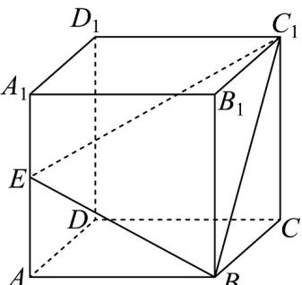

<!-- question-source:start -->
38. 如图，正方体 $ABCD - A_{1}B_{1}C_{1}D_{1}$ 中， $E$ 为 $AA_{1}$ 的中点·

(1)若点 F 满足 $2\overline{FD}_{1}=\overline{D}_{1}D$ ，求证：E,B,F, $C_{1}$ 四点共面；

(2)求直线 AB 与平面 $EBC_{1}$ 所成角的正弦值.
<!-- question-source:end -->

![[高中/课堂同步/题库/人教A版高中数学同步讲义(2026)/02_必修第二册/期中专项训练+期中模拟卷/专题19 空间直线、平面的垂直-线面垂直（高效培优期中专项训练）数学人教A版高一必修第二册/专题19_空间直线_平面的垂直_线面垂直/questions/answers/Q00077385A1.md]]
