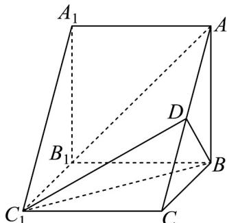

<!-- question-source:start -->
40. 如图，在三棱柱 $ABC - A_{1}B_{1}C_{1}$ 中，侧棱 $AA_{1} \perp$ 底面 $ABC$ ， $AB \perp BC$ ， $D$ 为 $AC$ 的中点， $AA_{1} = AB = BC = 2$ .

(1)求证： $AB_{1} / /$ 平面 $BC_{1}D$

(2)求证： $BD \perp$ 平面 $AA_{1}C_{1}C$

(3)求直线 $BC_{1}$ 与平面 $AA_{1}C_{1}C$ 所成角的大小.
<!-- question-source:end -->

![[高中/课堂同步/题库/人教A版高中数学同步讲义(2026)/02_必修第二册/期中专项训练+期中模拟卷/专题19 空间直线、平面的垂直-线面垂直（高效培优期中专项训练）数学人教A版高一必修第二册/专题19_空间直线_平面的垂直_线面垂直/questions/answers/Q00077387A1.md]]
