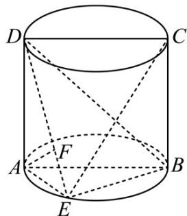

<!-- question-source:start -->
42. 如图，圆柱轴截面 $ABCD$ 是正方形， $AD = 2$ ，点 $E$ 在底面圆周上（除 $A, B$ 外）， $AF \perp DE$ ， $F$ 为垂足。

(1)求证： $AF \perp$ 平面 BDE；

(2)当直线 $DE$ 与平面 $ABE$ 所成角的正切值为 $\sqrt{2}$ 时，求三棱锥 $E - ABD$ 的体积.
<!-- question-source:end -->

![[高中/课堂同步/题库/人教A版高中数学同步讲义(2026)/02_必修第二册/期中专项训练+期中模拟卷/专题19 空间直线、平面的垂直-线面垂直（高效培优期中专项训练）数学人教A版高一必修第二册/专题19_空间直线_平面的垂直_线面垂直/questions/answers/Q00077389A1.md]]
