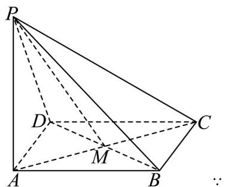

> [!faq]- 《专题19 空间直线、平面的垂直-线面垂直（高效培优期中专项训练）数学人教A版高一必修第二册》官方解析
>
> > [!success]- **【答案】** (1)1 (2) $45^{\circ}$
>
> > [!note]- **【解析】**
> > （1）（1）已知底面ABCD是边长为2的菱形，∴AB=AD=2，又 $\angle BAD=60^{\circ}$
> >
> > 所以 $\triangle ABD = \frac{1}{2}\cdot |AB|\cdot |AD|\cdot \sin \angle BAD = \frac{1}{2}\times 2\times 2\times \frac{\sqrt{3}}{2} = \sqrt{3}$
> >
> > 又侧棱 $PA \perp$ 平面ABCD，即三棱锥 $P - ABD$ 的高 $h = |PA| = \sqrt{3}$
> >
> > 因此可得： $V_{P-ABD}=\frac{1}{3}\cdot S_{\triangle ABD}\cdot h=\frac{1}{3}\cdot\sqrt{3}\cdot\sqrt{3}=1$
> >
> > (2) 如图，取 BD 中点 M ，
> >
> > 
> >
> > 为菱形中心，
> >
> > $$
> > A M \perp B D
> > $$
> >
> > ∵ PA⊥平面ABCD，BD⊂平面ABCD，∴PA⊥BD
> >
> > ∵ PA, AM ⊂ 平面 PAM ，且 $PA \cap AM = A$ ，∴ BD ⊥ 平面 PAM ，
> >
> > ∵ $PM \subset$ 平面 PAM ，∴ $BD \perp PM$
> >
> > $\therefore \angle PMA$ 为二面角 $P - BD - A$ 的平面角.
> >
> > 已知底面 ABCD 是边长为 $^{2}$ 的菱形，∴ AB = AD = 2 ，又 $\angle BAD = 60^{\circ}$
> >
> > $\therefore \triangle ABD$ 为等边三角形，可得： $AM = 2\cdot \cos 30^{\circ} = 2\times \frac{\sqrt{3}}{2} = \sqrt{3}$
> >
> > 又 $\because \triangle PAM$ 为直角三角形， $PA = \sqrt{3}$ ， $\therefore \tan \angle PMA = \frac{PA}{AM} = \frac{\sqrt{3}}{\sqrt{3}} = 1.$
> >
> > 故二面角 P-BD-A 的大小为 $45^{\circ}$
