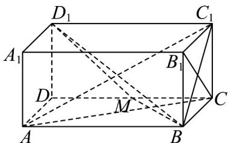
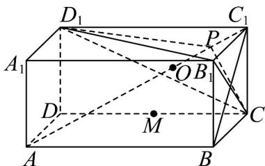

> [!faq]- 《专题19 空间直线、平面的垂直-线面垂直（高效培优期中专项训练）数学人教A版高一必修第二册》官方解析
>
> > [!success]- **【答案】** (1) $90^{\circ}$ (2)证明见解析 (3) $\frac{1}{3}$
>
> > [!note]- **【解析】**
> > （1）连接 $B_{1}C$ ，
> >
> > 
> >
> > 由四边形 $BCC_{1}B_{1}$ 为正方形，可得 $B_{1}C \perp BC_{1}$
> >
> > 在长方体 $ABCD - A_{1}B_{1}C_{1}D_{1}$ 中， $AB \perp$ 平面 $BCC_{1}B_{1}$ ，又 $B_{1}C \subset$ 平面 $BCC_{1}B_{1}$
> >
> > 所以 $B_{1}C \perp AB$ ，因为 $AB \mid BC_{1} = B$ ， $AB$ ， $BC_{1} \subset$ 平面 $ABC_{1}$
> >
> > 所以 $B_{1}C \perp$ 平面 $ABC_{1}$ ，又 $AC_{1} \subset$ 平面 $ABC_{1}$ ，所以 $B_{1}C \perp AC_{1}$
> >
> > 即异面直线 $B_{1}C$ 与 $AC_{1}$ 所成的角的大小为 $90^{\circ}$ ;
> >
> > (2) 当 $m = \sqrt{2}$ 时， $\left|CM\right| = \frac{\sqrt{2}}{2}$ ，
> >
> > 因为 $|BC| = 1$ ，所以 $\frac{|AB|}{|BC|} = \frac{|BC|}{|CM|} = \sqrt{2}$
> >
> > 所以 $\mathrm{Rt}^{\triangle} ABC \sim \mathrm{Rt}^{\triangle} BCM$ ，则 $\angle CAB = \angle MBC$
> >
> > 所以 $\angle MBC + \angle ACB = \angle CAB + \angle ACB = 90^{\circ}$ ，即 $AC\perp BM$
> >
> > 在长方体 $ABCD-A_{1}B_{1}C_{1}D_{1}$ 中， $CC_{1}\perp$ 平面 ABCD ，又 $BM\subset$ 平面 ABCD ，
> >
> > 所以 $CC_{1} \perp BM$ ，因为 $AC \cap CC_{1} = C, AC, CC_{1} \subset$ 平面 $ACC_{1}$
> >
> > 所以 $BM \perp$ 平面 $ACC_{1}$ ，又 $AC_{1} \subset$ 平面 $ACC_{1}$ ，
> >
> > 所以 $BM \perp AC_{1}$
> >
> > 同理 $D_{1}M \perp AC_{1}$ ，又 $D_{1}M \cap BM = M, D_{1}M, BM \subset$ 平面 $BMD_{1}$
> >
> > 所以直线 $AC_{1} \perp$ 平面 $BMD_{1}$ ;
> >
> > (3) 设 $AC_{1}$ 与平面 $B_{1}CD_{1}$ 的斜足为 O，
> >
> > 
> >
> > 因为 $V_{C_{1}-B_{1}CD_{1}} = V_{B_{1}-C_{1}CD_{1}} = \frac{1}{3} \cdot \frac{1}{2} \cdot 1 \cdot m \cdot 1 = \frac{m}{6}$
> >
> > $$
> > V _ {A - B _ {1} C D _ {1}} = V _ {A B C D - A _ {1} B _ {1} C _ {1} D _ {1}} - V _ {B _ {1} - A B C} - V _ {B _ {1} - C _ {1} C D} - V _ {A - A _ {1} B _ {1} D _ {1}} - V _ {D _ {1} - A C D} = V _ {A B C D - A _ {1} B _ {1} C _ {1} D _ {1}} - 4 V _ {B _ {1} - C _ {1} C D _ {1}} = \frac {m}{3}
> > $$
> >
> > 所以 $V_{A-B_{1}CD_{1}} = 2V_{C_{1}-B_{1}CD_{1}}$ ，则 $\left|AO\right| = 2\left|C_{1}O\right|$ ，故 $\left|C_{1}O\right| = \left|PO\right|$ ，
> >
> > 所以在线段 $AC_{1}$ 上取一点 P，要使三棱锥 $B_{1}-CD_{1}C_{1}$ 与三棱锥 $B_{1}-CD_{1}P$ 的体积相等，
> >
> > 则 $P$ 为 $AO$ 的中点，即 $\frac{|AP|}{|AC_1|} = \frac{1}{3}$
