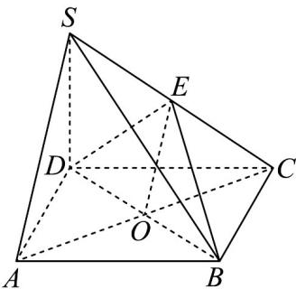

> [!faq]- 《专题19 空间直线、平面的垂直-线面垂直（高效培优期中专项训练）数学人教A版高一必修第二册》官方解析
>
> > [!success]- **【答案】** (1)证明见解析 (2)证明见解析
>
> > [!note]- **【解析】**
> > （1）连接 $AC$ ，交 $BD$ 于 $O$ ，连结 $OE$
> >
> > ∵四棱锥 S-ABCD 的底面是边长为 $^{2}$ 的正方形，
> >
> > ∴O 是 AC 的中点，∵E 为 SC 的中点，∴ OE //SA
> >
> > 
> >
> > ∵OE⊂平面BDE，SA∉平面BDE，∴SA//平面BDE；
> >
> > (2)∵AC、BD为正方形ABCD的对角线
> >
> > $\because SD \perp$ 平面ABCD，且 $AC \subset$ 平面ABCD
> >
> > $\therefore SD \perp AC$
> >
> > 又∵ $BD\cap SD=D$ ，BD, $SD\subset$ 平面SBD
> >
> > $\therefore AC \perp$ 平面SBD.
