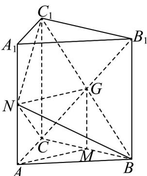

> [!faq]- 《专题19 空间直线、平面的垂直-线面垂直（高效培优期中专项训练）数学人教A版高一必修第二册》官方解析
>
> > [!success]- **【答案】** (1)证明见解析 (2)证明见解析
>
> > [!note]- **【解析】**
> > （1）证明：连接 $B_{1}C$ 交 $BC_{1}$ 于 $G$ ，连 $MG,NG$
> >
> > 在三棱柱 $ABC - A_{1}B_{1}C_{1}$ 中，矩形 $CBB_{1}C_{1}$ 中， $CB_{1} \cap BC_{1} = G$ ，则 $C_{1}G = BG$
> >
> > 因为 $M, G$ 分别为 $BC, BC_{1}$ 的中点，所以 $MG // CC_{1}$ 且 $MG = \frac{1}{2} CC_{1}$
> >
> > 因为 $N$ 为 $AA_{1}$ 中点，所以 $AN / / CC_{1}$ 且 $AN = \frac{1}{2} CC_{1}$
> >
> > 所以 $MG / / AN$ 且 $MG = AN$
> >
> > 所以四边形 AMGN 为平行四边形，所以 AM // GN
> >
> > 因为 $AM \subsetneq$ 平面 $BNC_{1}, GN \subset$ 平面 $BNC_{1}$
> >
> > 所以 $AM / /$ 平面 $BNC_{1}$
> >
> > 
> >
> > (2) 证明：因为 $AA_{1} \perp$ 底面 $ABC$ ， $BC \subset$ 平面 $ABC$ ，所以 $AA_{1} \perp BC$
> >
> > 因为 $AA_{1} \parallel CC_{1}$ ，所以 $BC \perp CC_{1}$ ，
> >
> > 因为 $\angle ACB = 90^{\circ}$ ，所以 $BC\perp AC$
> >
> > 因为 $AC \cap CC_{1} = C, AC, CC_{1} \subset$ 平面 $ACC_{1}A_{1}$ ，所以 $BC \perp$ 平面 $ACC_{1}A_{1}$
> >
> > 因为 $BC \perp AC, BC \perp CC_{1}, AC \cap CC_{1} = C, AC, CC_{1} \subset$ 平面 $ACC_{1}A_{1}$
> >
> > 因为 $NC_{1} \subset$ 平面 $ACC_{1}A_{1}$ ，所以 $BC \perp NC_{1}$
> >
> > 因为在矩形 $ACC_{1}A_{1}$ 中， $AA_{1}=2AC,N$ 为 $AA_{1}$ 的中点，
> >
> > 所以 $AC = AN = A_{1}N = A_{1}C_{1}$
> >
> > 因为 $AA_{1} \perp$ 底面 $ABC$ ， $AC \subset$ 平面 $ABC$ ，所以 $AA_{1} \perp AC$
> >
> > 所以 $\Delta C_{1}A_{1}N,\Delta CAN$ 均为等腰直角三角形，
> >
> > 所以 $\angle ANC = A_{1}NC_{1} = 45^{\circ}$ ，所以 $\angle C_1NC = 90^\circ$
> >
> > 所以 $NC_{1} \perp CN$ ，
> >
> > 因为 $NC_{1} \perp BC, NC_{1} \perp CN, CN \cap BC = C, CN, BC \subset$ 平面 $NBC$
> >
> > 所以 $NC_{1} \perp$ 平面 NBC.
