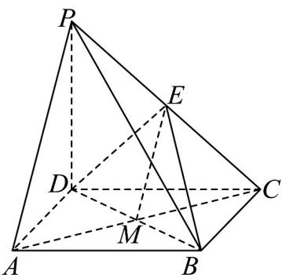

> [!faq]- 《专题19 空间直线、平面的垂直-线面垂直（高效培优期中专项训练）数学人教A版高一必修第二册》官方解析
>
> > [!success]- **【答案】** $^{(1)}$ 证明见解析 (2)证明见解析 (3)证明见解析
>
> > [!note]- **【解析】**
> > （1）连接 $AC$ ，交 $BD$ 于 $M$ ，如下图所示：
> >
> > 
> >
> > 因为底面 $ABCD$ 是正方形，故 $M$ 为 $AC$ 的中点，所以 $ME // PA$
> >
> > 又因为 $EM \subset$ 平面 BDE， $AP \not\subset$ 平面 BDE，
> >
> > 所以 $AP / /$ 平面BDE；
> >
> > (2) $\because PD \perp$ 平面 $ABCD, BC \subset$ 平面 $ABCD \therefore PD \perp BC$
> >
> > 又∵在正方形ABCD中， $CD \perp BC$
> >
> > $PD\cap CD = D$ ， $PD$ ， $CD\subset$ 平面 $PCD$
> >
> > $\therefore BC \perp$ 平面 PCD ，
> >
> > 又∵ $DE\subset$ 平面PCD，∴ $BC\perp DE$
> >
> > $\because PD = CD$ ， $E$ 为 $PC$ 中点，故 $DE \perp PC$
> >
> > 又 $PC \cap BC = C$ ，且 $PC \subset$ 平面 $PCB$ ， $BC \subset$ 平面 $PCB$
> >
> > $\therefore DE \perp$ 平面 $PCB$
> >
> > (3) 在正方形 ABCD 中，有 $AB \parallel CD$ ，
> >
> > 因为 $AB \not\subset$ 平面 PCD ， $CD \subset$ 平面 PCD ，
> >
> > 所以 AB // 平面 PCD，
> >
> > 又因为 $AB \subset$ 面 $PAB$ ，平面 $PAB \cap$ 平面 $PCD = l$ ，所以 $AB // l$
> >
> > 又因为 $l \notin$ 平面ABCD， $AB \subset$ 平面ABCD
> >
> > 所以 $l //$ 平面ABCD.
> >
> > ## 考点 02 补全线面垂直的条件
