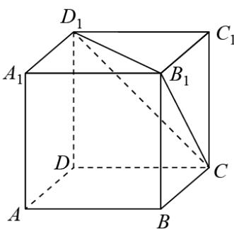
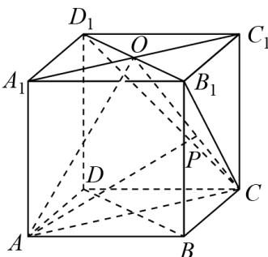

> [!faq]- 《专题19 空间直线、平面的垂直-线面垂直（高效培优期中专项训练）数学人教A版高一必修第二册》官方解析
>
> > [!success]- **【答案】** $^{(1)}$ 证明见解析 (2) $\frac{PG}{GC} = \frac{3}{2}$
>
> > [!note]- **【解析】**
> > （1）证明：因为 $BA = BC$ ， $DA = DC$ ， $BD = BD$ ，所以， $\triangle ABD\cong \triangle CBD$ 所以， $\angle ABD = \angle CBD$ ，则 $BD\perp AC$ ，
> >
> > 因为 $PA \perp$ 平面 ABCD ， $BD \subset$ 平面 ABCD ，所以， $BD \perp PA$
> >
> > 又因为 $AC \cap PA = A$ ，AC、 $PA \subset$ 平面 APC，所以， $BD \perp$ 平面 APC。
> >
> > (2) 解：因为 $BD \perp$ 平面 APC， $PC \subset$ 平面 APC，所以， $PC \perp BD$ ，
> >
> > 若 $PC \perp$ 面 $BGD$ ， $BG \subset$ 平面 $BGD$ ，则 $BG \perp PC$ ，
> >
> > 因为 $AB = BC = 2$ ， $\angle ABC = 120^{\circ}$
> >
> > 由余弦定理可得 $AC = \sqrt{AB^2 + BC^2 - 2AB\cdot BC\cos 120^\circ} = \sqrt{2^2 + 2^2 - 2\times 2^2\times\left(-\frac{1}{2}\right)} = 2\sqrt{3}$
> >
> > 因为 $PA \perp$ 平面 $ABCD$ ， $AB$ 、 $AC \subset$ 平面 $ABCD$ ，则 $PA \perp AC$ ，
> >
> > 所以， $PC = \sqrt{PA^2 + AC^2} = \sqrt{3 + 12} = \sqrt{15}$ ， $PB = \sqrt{PA^2 + AB^2} = \sqrt{3 + 4} = \sqrt{7}$
> >
> > 在 $\triangle PBC$ 中， $PB = \sqrt{7}$ ， $BC = 2$ ， $PC = \sqrt{15}$
> >
> > 所以， $\cos \angle PCB = \frac{PC^2 + BC^2 - PB^2}{2PC\cdot BC} = \frac{15 + 4 - 7}{2\times 2\times\sqrt{15}} = \frac{\sqrt{15}}{5}$
> >
> > 所以， $CG = BC \cos \angle PCB = 2 \times \frac{\sqrt{15}}{5} = \frac{2\sqrt{15}}{5}$
> >
> > 所以， $PG = PC - CG = \sqrt{15} - \frac{2\sqrt{15}}{5} = \frac{3\sqrt{15}}{5}$ ，则 $\frac{PG}{GC} = \frac{3\sqrt{15}}{5} \times \frac{5}{2\sqrt{15}} = \frac{3}{2}$
> >
> > 因此，若 G 满足 $PC \perp$ 面 BGD，则 $\frac{PG}{GC} = \frac{3}{2}$ .
> >
> > 7．正方体 $ABCD - A_{1}B_{1}C_{1}D_{1}$ 的棱长为 1，点 P 是 $\triangle B_{1}CD_{1}$ 内不包括边界的动点，若 $BD \perp AP$ ，则线段 AP 长度的最小值为 \_\_\_\_。
> >
> > 【答案】
> >
> > 
> >
> > 【答案】 $\frac{2\sqrt{3}}{3} / \frac{2}{3}\sqrt{3}$
> >
> > 【详解】 $A_{1}C_{1}$ 与 $B_{1}D_{1}$ 相交于 O，连接 AO，AC，BD，
> >
> > $AA_{1}\perp BD$ ， $AC\perp BD$ ， $AA_{1}\cap AC=A$ ，故 $BD\perp$ 平面 $AA_{1}OC$ ， $BD\perp AP$
> >
> > 故 $AP \subset$ 平面 $OAC$ ， $P$ 是 $\triangle B_{1}CD_{1}$ 内不包括边界的动点，故 $P$ 在 $OC$ 上，
> >
> > 当 $AP \perp OC$ 时， $AP$ 最小
> >
> > 
> >
> > $\triangle AOC$ 中， $AC=\sqrt{2}$ ，AO=CO= $\sqrt{1^{2}+\left(\frac{\sqrt{2}}{2}\right)^{2}}=\frac{\sqrt{6}}{2}$ ，
> >
> > 根据等面积法： $AP=\frac{AC\times1}{OC}=\frac{2\sqrt{3}}{3}$
> >
> > 故答案为： $\frac{2\sqrt{3}}{3}$
