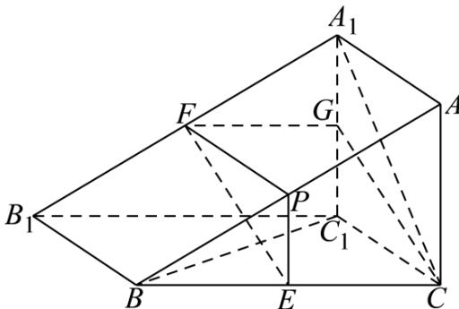

> [!faq]- 《专题19 空间直线、平面的垂直-线面垂直（高效培优期中专项训练）数学人教A版高一必修第二册》官方解析
>
> > [!success]- **【答案】** (1)证明见解析 (2) 存在， $\frac{AP}{AB} = \frac{1}{2}$
>
> > [!note]- **【解析】**
> > （1）证明：取 $A_{1}C_{1}$ 中点 $G$ ，连接 $FG$ 、 $CG\cdot$
> >
> > 因为 F 、 G 分别是 $A_{1}B_{1}$ 、 $A_{1}C_{1}$ 的中点，
> >
> > 所以 $FG \parallel B_{1}C_{1}$ 且 $FG = \frac{1}{2}B_{1}C_{1}$ .
> >
> > 在平行四边形 $BCC_{1}B_{1}$ 中， $B_{1}C_{1}//BC$ 且 $B_{1}C_{1}=BC$
> >
> > 因为 E 是 BC 的中点，所以 $EC \parallel B_{1}C_{1}$ 且 $EC = \frac{1}{2}B_{1}C_{1}$ .
> >
> > 所以 $EC // FG$ 且 $EC = FG$ ，所以四边形 $FECG$ 是平行四边形，所以 $FE // GC$
> >
> > 又因为 $FE \notin$ 平面 $A_{1}C_{1}CA$ ， $GC \subset$ 平面 $A_{1}C_{1}CA$ ，所以 $EF //$ 平面 $A_{1}C_{1}CA$ .
> >
> > (2) 解：当点 P 为线段 AB 的中点时， $BC_{1} \perp$ 平面 EFP，理由如下：
> >
> > 取 AB 的中点 P，连接 PE、PF·
> >
> > 
> >
> > 因为 $BC_{1} \perp CC_{1}$ ， $BC_{1} \wedge A_{1}C$ ， $A_{1}C \cap CC_{1} = C$ ，所以， $BC_{1} \perp$ 平面 $ACC_{1}A_{1}$ ，
> > 因为 P、E 分别为 AB、BC 的中点，则 PE//AC，
> >
> > ∵ $PE \not\subset$ 平面 $ACC_{1}A_{1}$ ， $AC \subset$ 平面 $ACC_{1}A_{1}$ ，则 $PE \parallel$ 平面 $ACC_{1}A_{1}$
> >
> > 又因为 $EF//$ 平面 $ACC_{1}A_{1}$ ， $EF \cap PE = E$ ，所以，平面 $EFP//$ 平面 $ACC_{1}A_{1}$ ，所以， $BC_{1} \perp$ 平面 $EFP$ .
> >
> > 故当点 P 是线段 AB 的中点时， $BC_{1} \perp$ 平面 EFP，此时， $\frac{AP}{AB} = \frac{1}{2}$
