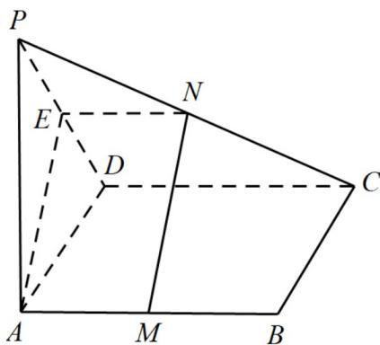

> [!faq]- 《专题19 空间直线、平面的垂直-线面垂直（高效培优期中专项训练）数学人教A版高一必修第二册》官方解析
>
> > [!success]- **【答案】** (1)证明见详解 (2) 当 PA = AD 时， $MN \perp$ 平面 PCD
>
> > [!note]- **【解析】**
> > （1）取 $PD$ 的中点 $E$ ，连接 $AE, EN$
> >
> > ∵E,N分别为PD,PC的中点，则 $EN\parallel CD$ 且 $EN=\frac{1}{2}CD$
> >
> > 又∵M 是 AB 的中点且四边形 ABCD 为矩形，则 $AM \parallel CD$ 且 $AM = \frac{1}{2}CD$
> >
> > 则 $EN \parallel AM$ 且 $EN = AM$ ，即 $AMNE$ 为平行四边形，则 $AE \parallel MN$
> >
> > $AE \subset$ 平面 PAD， $MN \notin$ 平面 PAD
> >
> > ∴MN∥平面PAD
> >
> > (2) 若 $MN^{\perp}$ 平面 PCD， $AE \parallel MN$ ，则 $AE_{\perp}$ 平面 PCD
> >
> > $\therefore AE \perp PD$ ，且 $E$ 为 $PD$ 的中点
> >
> > $\therefore PA = AD$
> >
> > 若 $PA = AD$ 且 $E$ 为 $PD$ 的中点，则 $AE \perp PD$
> >
> > ∵ $PA \perp$ 平面 ABCD，则 $PA \perp CD$
> >
> > 四边形 $ABCD$ 为矩形，则 $AD \perp CD$
> >
> > $PA \cap AD = A$ ，则 $CD \perp$ 平面 PAD
> >
> > $AE \subset$ 平面 PAD ，则 $AE \perp CD$
> >
> > $PD \cap CD = D$ ，则 $AE \perp$ 平面 PCD
> >
> > $AE \parallel MN$ ，则 $MN^{\perp}$ 平面 PCD
> >
> > 综上所述：当 $PA = AD$ 时， $MN^{\perp}$ 平面 $PCD$
> >
> > 
