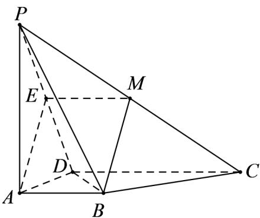
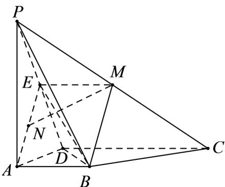

> [!faq]- 《专题19 空间直线、平面的垂直-线面垂直（高效培优期中专项训练）数学人教A版高一必修第二册》官方解析
>
> > [!success]- **【答案】** （1）证明见解析；（2）存在；N 为 AE 的中点。
>
> > [!note]- **【解析】**
> > （1）证明：取 $PD$ 的中点 $E$ ，连接 $EM, AE$ ，则有 $EM // CD$ 且 $EM = \frac{1}{2} CD$ ，而 $AB // CD$ 且 $AB = \frac{1}{2} CD$ ， $\therefore AB // EM, AB = EM$ .
> >
> > 
> >
> > ∴四边形 ABME 是平行四边形，即 $BM^{\parallel}AE$
> >
> > ∵AE⊂平面 PAD，BM∉平面 PAD，
> >
> > $\therefore BM^{\parallel}$ 平面 PAD
> >
> > (2) 解：当 N 为 AE 的中点时， $MN^{\perp}$ 平面 PBD．理由如下：
> >
> > 
> >
> > ∵PA⊥平面ABCD，AB⊂平面ABCD，
> >
> > $\therefore PA \perp AB$ ，又 $AB \perp AD$ ， $PA \cap AD = A$ ，即 $AB \perp$ 平面 $PAD$ ，
> >
> > ∵PD⊂平面 PAD，
> >
> > $\therefore AB \perp PD$ ，又 $PA = AD$ ， $E$ 是 $PD$ 的中点，即 $AE \perp PD$ ，而 $AB \cap AE = A$
> >
> > $\therefore PD^{\perp}$ 平面 ABME .
> >
> > 作 $MN \perp BE$ ，交 AE 于点 N，
> >
> > $\therefore MN\perp PD$ ，又 $PD\cap BE = E$ ，
> >
> > $\therefore MN^{\perp}$ 平面 PBD .
> >
> > 易知 $\triangle BME\sim \triangle MEN$ ，而 $BM = \sqrt{2},EM = AB = 1$
> >
> > $\therefore \frac{BM}{EM} = \frac{EM}{EN}$ ，即 $EN = \frac{EM^2}{BM} = \frac{\sqrt{2}}{2}$ ，而 $AE = \sqrt{2}$
> >
> > ∴N为AE的中点.
> >
> > ## 考点 03 线面垂直证明线线平行
