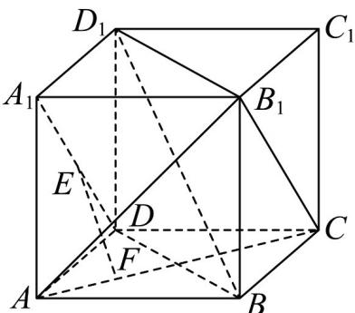

> [!faq]- 《专题19 空间直线、平面的垂直-线面垂直（高效培优期中专项训练）数学人教A版高一必修第二册》官方解析
>
> > [!success]- **【答案】** (1)证明见解析 (2)证明见解析
>
> > [!note]- **【解析】**
> > （1）在正方体 $ABCD - A_{1}B_{1}C_{1}D_{1}$ 中， $CD // A_{1}B_{1}$ 且 $CD = A_{1}B_{1}$
> >
> > 所以四边形 $A_{1}B_{1}CD$ 是平行四边形，所以 $A_{1}D//B_{1}C$
> >
> > 因为 $EF \perp A_{1}D$ ，所以 $EF \perp B_{1}C$
> >
> > 因为 $EF \perp AC$ ， $AC \cap B_{1}C = C$ ， $B_{1}C \subset$ 平面 $AB_{1}C$ ， $AC \subset$ 平面 $AB_{1}C$
> >
> > 所以 $EF \perp$ 平面 $AB_{1}C$
> >
> > 
> >
> > (2) 因为 $DD_{1} \perp$ 平面 ABCD， $AC \subset$ 平面 ABCD，
> >
> > 所以 $DD_{1} \perp AC$
> >
> > 又因为 $BD \perp AC$ ， $DD_{1}\mathrm{I} BD = D$ ， $BD \subset$ 平面 $BDD_{1}B_{1}$ ， $DD_{1} \subset$ 平面 $BDD_{1}B_{1}$
> >
> > 所以 $AC \perp$ 平面 $BDD_{1}B_{1}$
> >
> > 因为 $BD_{1} \subset$ 平面 $BDD_{1}B_{1}$ ，所以 $AC \perp BD_{1}$
> >
> > 同理可证 $BD_{1} \perp B_{1}C$
> >
> > 又 $AC \cap B_{1}C = C$ ， $B_{1}C \subset$ 平面 $AB_{1}C$ ， $AC \subset$ 平面 $AB_{1}C$
> >
> > 所以 $BD_{1} \perp$ 平面 $AB_{1}C$
> >
> > 又 $EF \perp$ 平面 $AB_{1}C$ ，所以 $EF // BD_{1}$
