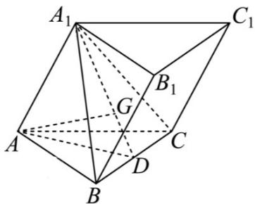

> [!faq]- 《专题19 空间直线、平面的垂直-线面垂直（高效培优期中专项训练）数学人教A版高一必修第二册》官方解析
>
> > [!success]- **【答案】** (1)证明见解析； (2)证明见解析·
>
> > [!note]- **【解析】**
> > （1）在三棱柱 $ABC-A_{1}B_{1}C_{1}$ 中，连 $A_{1}G$ 交BC于D，连AD，由G为 $\triangle A_{1}BC$ 的重心，得D为BC的中点，
> >
> > 由 $AB = AC$ ， $A_{1}A = A_{1}A$ ， $\angle A_{1}AB = \angle A_{1}AC$ ，得 $\triangle A_{1}AB\cong \triangle A_{1}AC$ ，则 $A_{1}B = A_{1}C$
> >
> > 因此 $AD \perp BC$ ， $A_{1}D \perp BC$ ，又 $AD \cap A_{1}D = D, AD, A_{1}D \subset$ 平面 $A_{1}AD$
> >
> > 于是 $BC \perp$ 平面 $A_{1}AD$ ，而 $A_{1}A \subset$ 平面 $A_{1}AD$ ，则 $BC \perp A_{1}A$ ，又 $A_{1}A // B_{1}B$
> >
> > 所以 $BC \perp B_{1}B$
> >
> > 
> >
> > (2) 由 $A_{1}A = AB = 2$ ， $\angle A_{1}AB = 60^{\circ}$ ，得 $\triangle A_{1}AB$ 为正三角形；同理 $\triangle A_{1}AC$ 也为正三角形，
> >
> > 则 $A_{1}B = A_{1}C = BC = 2$ ，从而三棱锥 $A - A_{1}BC$ 的所有棱长均为 $^2$ ，该四面体为正四面体，
> >
> > 由 $G$ 为 $\triangle A_{1}BC$ 的重心，得 $AG \perp$ 平面 $A_{1}BC$ ，菱形 $ACC_{1}A_{1}$ 中， $AC_{1}$ 过 $A_{1}C$ 的中点，
> >
> > 即直线 $AC_{1}$ 与平面 $A_{1}BC$ 的交点为 $A_{1}C$ 的中点，因此 G 不在直线 $AC_{1}$ 上，又 $C_{1}P \perp$ 平面 $A_{1}BC$
> >
> > $$
> > A G / / C _ {1} P
> > $$
