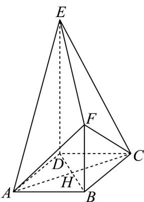

> [!faq]- 《专题19 空间直线、平面的垂直-线面垂直（高效培优期中专项训练）数学人教A版高一必修第二册》官方解析
>
> > [!success]- **【答案】** (1)证明见解析 (2)8
>
> > [!note]- **【解析】**
> > （1）因为 $DE \perp$ 平面ABCD， $BF \perp$ 平面ABCD
> >
> > 所以 DE // BF ，
> >
> > 因为 $DE \subset$ 平面 CDE ， $BF \not\subset$ 平面 CDE ，
> >
> > 所以 BF // 平面 CDE，
> >
> > 因为四边形 ABCD 是正方形，所以 $AB \parallel CD$ ，
> >
> > 因为 $CD \subset$ 平面 CDE ， $AB \notin$ 平面 CDE ，
> >
> > 所以 AB // 平面 CDE ，
> >
> > 又 $AB \subset$ 平面 $ABF, BF \subset$ 平面 $ABF$ ，且 $AB \cap BF = B$
> >
> > 所以平面 $ABF \parallel$ 平面 $CDE$ .
> >
> > (2) 如图，连接 $AC, BD$ ，记 $AC \cap BD = H$
> >
> > 
> >
> > 因为四边形ABCD是正方形，
> >
> > 所以 $AC \perp BD, AH = CH = \frac{1}{2} AC$
> >
> > 因为 $DE \perp$ 平面 ABCD, ACì 平面 ABCD
> >
> > 所以 $DE \perp AC$ ，
> >
> > 因为 $DE \subset$ 平面 $BDEF, BD \subset$ 平面 $BDEF$ ，且 $DE \cap BD = D$
> >
> > 所以 $AC \perp$ 平面 BDEF ，
> >
> > 因为 $DE = 2BF = 2AB$ ，且 $AB = 2$ ，所以 $BF = 2, DE = 4$
> >
> > 因为四边形 $ABCD$ 是正方形，所以 $AC = BD = 2\sqrt{2}$
> >
> > 则 $AH = CH = \sqrt{2}$
> >
> > 故多面体 ABCDEF 的体积 $V = V_{ABDEF} + V_{CBDEF}$
> >
> > $$
> > = \frac {1}{3} \times \frac {(2 + 4) \times 2 \sqrt {2}}{2} \times \sqrt {2} + \frac {1}{3} \times \frac {(2 + 4) \times 2 \sqrt {2}}{2} \times \sqrt {2} = 8
> > $$
