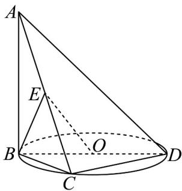
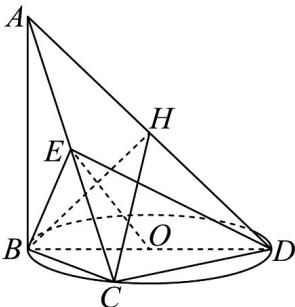
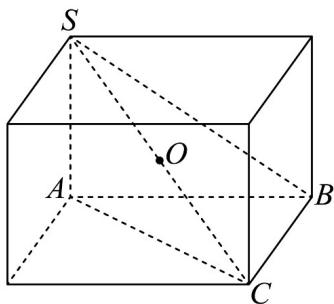
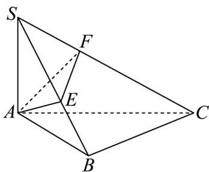
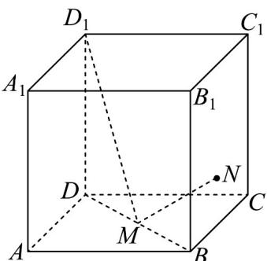
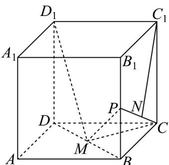

> [!faq]- 《专题19 空间直线、平面的垂直-线面垂直（高效培优期中专项训练）数学人教A版高一必修第二册》官方解析
>
> > [!success]- **【答案】**  A. 若 $AD$ 的长为定值，则该三棱锥外接球的半径也为定值 B. 若 $AC$ 的长为定值，则该三棱锥内切球的半径也为定值 C. 若 $BD$ 的长为定值，则 $EO$ 的长也为定值 D. 若 $CD$ 的长为定值，则 $\overline{EO} \cdot \overline{CD}$ 的长也为定值
>
> > [!note]- **【解析】**
> > 对于 $A$ ，取 $AD$ 的中点 $H$ ，如图所示，
> >
> > 
> >
> > Q $AB\perp$ $DB\subset \therefore AB\perp BD\therefore HB = \frac{1}{2} AD$
> >
> > $QAB \perp$ 平面 $BCD$ , $DC \subset$ 平面 $BCD$ , $\therefore AB \perp CD$
> >
> > ∵ BC ⊥ CD ， BC ∩ AB = B ， BC、 AB ⊂ 平面 ABC ，
> >
> > $\backslash CD^{\wedge}$ 平面 $ABC$ ， $AC \subset$ 平面 $ABC$ ， $\therefore CD \perp AC$
> >
> > $\therefore HC = \frac{1}{2} AD$ ， $\therefore H$ 为外接球的球心， $AD$ 是直径，该三棱锥外接球的半径为 $\frac{1}{2} AD$ ，故A正确；对于B，假设内切球的球心为 $O_{1}$ ，
> >
> > 第一种情况不妨假设 $AC = 5$ ， $AB = 3$ ， $BC = 4$ ， $CD = 4$ ， $BD = 4\sqrt{2}$ ，此时内切球的半径为 $r_1$ ，根据 $V_{A - BCD} = V_{O_1 - ABC} + V_{O_1 - ABD} + V_{O_1 - ACD} + V_{O_1 - BCD}$ ，即 $\frac{1}{3}\times S_{\triangle BCD}\times AB = \frac{1}{3}\times S_{\triangle ABC}\times r_1 + \frac{1}{3}\times S_{\triangle ABD}\times r_1 + \frac{1}{3}\times S_{\triangle ACD}\times r_1 + \frac{1}{3}\times S_{\triangle BCD}\times r_1$ 即 $\frac{1}{3}\times 4\times 4\times 3 = \frac{1}{3}\times 3\times 4\times r_1 + \frac{1}{3}\times 3\times 4\sqrt{2}\times r_1 + \frac{1}{3}\times 5\times 4\times r_1 + \frac{1}{3}\times 4\times 4\times r_1$
> >
> > 解得 $r_1 = \frac{8 - 2\sqrt{2}}{7}$
> >
> > 第二种情况不妨假设 $AC = 5$ ， $AB = 3$ ， $BC = 4$ ， $CD = 3$ ， $BD = 5$ ，此时内切球的半径为 $r_2$ ，
> >
> > 根据 $V_{A-BCD}=V_{O_{1}-ABC}+V_{O_{1}-ABD}+V_{O_{1}-ACD}+V_{O_{1}-BCD}$
> >
> > 即 $\frac{1}{3} \times S_{\triangle BCD} \times AB = \frac{1}{3} \times S_{\triangle ABC} \times r_2 + \frac{1}{3} \times S_{\triangle ABD} \times r_2 + \frac{1}{3} \times S_{\triangle ACD} \times r_2 + \frac{1}{3} \times S_{\triangle BCD} \times r_2$
> >
> > $$
> > \frac {1}{3} \times 4 \times 3 \times 3 = \frac {1}{3} \times 3 \times 4 \times r _ {2} + \frac {1}{3} \times 3 \times 5 \times r _ {2} + \frac {1}{3} \times 5 \times 3 \times r _ {2} + \frac {1}{3} \times 4 \times 3 \times r _ {2}
> > $$
> >
> > 解得 $r_{2}=\frac{2}{3}$ ;
> >
> > 综上所述，当 $AC$ 的长为定值，三棱锥内切球的半径不为定值，故 ${}^{\mathrm{B}}$ 错误；
> >
> > 对于 C，由选项 A 可知 $CD \perp BE$ ，又 $BE \perp AC$ ， $AC \cap CD = C$ ，AC、 $CD \subset$ 平面 ACD，
> >
> > $\therefore BE \perp$ 平面 $ACD, DE \subset$ 平面 $ACD, \therefore BE \perp ED,$
> >
> > $\therefore EO = \frac{1}{2} BD$ ，若 $BD$ 的长为定值，则 $EO$ 的长也为定值，故 ${}^{\mathrm{C}}$ 正确；
> >
> > 对于 D，由以上分析可知 $CD \perp BE$ ， $CD \perp EC$ ，故 $CD \cdot BE = 0$ ， $CD \cdot EC = 0$ ，
> >
> > 由于 $O$ 为 $BD$ 中点，
> >
> > 故 $\overset{\square\square}{EO}\cdot\overset{\square\square}{CD}=\frac{1}{2}\left(\overset{\square\square}{ED}+\overset{\square\square}{EB}\right)\cdot\overset{\square\square}{CD}=\frac{1}{2}\left(\overset{\square\square}{EC}+\overset{\square\square}{CD}+\overset{\square\square}{EB}\right)\cdot\overset{\square\square}{CD}$
> >
> > $= \frac{1}{2} EC\cdot CD + \frac{1}{2} CD^2 +\frac{1}{2} EB\cdot CD = \frac{1}{2} CD^2,$
> >
> > 故 $CD$ 的长为定值，则 $\overline{EO} \cdot \overline{CD}$ 的值也为定值，故 ${}^{\mathrm{D}}$ 正确.
> >
> > 故选：ACD。
> >
> > 17. 三棱锥 $S - ABC$ 中， $\angle ABC = 90^{\circ}$ ，侧棱 $SA \perp$ 平面 $ABC$ ，点 $A$ 在棱 $SB$ 和 $SC$ 上的射影分别是点 $E$ ， $F$ .
> >
> > (1)当 $SA = AB = BC = 2$ 时，求三棱锥 $S - ABC$ 的体积；
> >
> > (2)若平面 $SAB$ 与平面 $ABC$ 截三棱锥 $S - ABC$ 外接球所得截面面积相等，证明： $SA = BC$
> >
> > (3)证明： $EF \perp SC$ .
> >
> > 【答案】(1) $\frac{4}{3}$
> >
> > (2)证明见解析
> >
> > (3)证明见解析
> >
> > 【详解】（1）因为 $SA \perp$ 平面 $ABC$ ，所以 $SA$ 为三棱锥 $S - ABC$ 的高，又 $\angle ABC = 90^{\circ}$ ， $SA = AB = BC = 2$ ，
> >
> > 所以三棱锥 S-ABC 的体积为 $\frac{1}{3}S_{\triangle ABC} \cdot SA = \frac{1}{3} \times \frac{1}{2} \times 2 \times 2 \times 2 = \frac{4}{3}$ ;
> >
> > (2) 因为 $SA \perp$ 平面 $ABC$ ， $BC \subset$ 平面 $ABC$ ，所以 $SA \perp BC$
> >
> > 因为 $\angle ABC = 90^{\circ}$ ，所以 $BC\perp AB$ ，因为 $AB\cap SA = A$ ， $AB,SA\subset$ 平面 $SAB$
> >
> > 所以 $BC \perp$ 平面 $SAB$ ，将三棱锥 $S - ABC$ 补全成长方体，如图，
> >
> > 
> >
> > 则三棱锥 S-ABC 外接球即为长方体的外接球，其球心 O 为 SC 的中点，
> >
> > 由 $SA \perp$ 平面 $ABC$ 知球心 $O$ 到平面 $ABC$ 的距离为 $\frac{1}{2} SA$
> >
> > 由 $BC \perp$ 平面 $SAB$ 知球心 $O$ 到平面 $SAB$ 的距离为 $\frac{1}{2} BC$
> >
> > 因为平面 SAB 与平面 ABC 截三棱锥 S-ABC 外接球所得截面面积相等，即截面圆的半径相等，设球 O 的半径为 R，两截面圆的半径为 r，
> >
> > 则根据球的性质有 $R^{2}=r^{2}+\left(\frac{1}{2}SA\right)^{2}$ ， $R^{2}=r^{2}+\left(\frac{1}{2}BC\right)^{2}$ ，
> >
> > 所以 $\frac{1}{2} SA = \frac{1}{2} BC$ ，即 $SA = BC$ ；
> >
> > (3)
> >
> > 
> >
> > 由（2）知 $BC \perp$ 平面 $SAB$ ，因为 $AE \subset$ 平面 $SAB$
> >
> > 所以 $BC \perp AE$
> >
> > 因为 $AE \perp SB$ ， $SB \cap BC = B$ ， $SB, BC \subset$ 平面 $SBC$
> >
> > 所以 $AE \perp$ 平面 $SBC$
> >
> > 因为 $SC \subset$ 平面 SBC ，所以 $AE \perp SC$
> >
> > 因为 $AF \perp SC$ ， $AE \cap AF = A$ ， $AE, AF \subset$ 平面 $AEF$
> >
> > 所以 $SC \perp$ 平面 $AEF$
> >
> > 因为 $EF \subset$ 平面 AEF ，
> >
> > 所以 $SC \perp EF$ .
> >
> > 18. 正方体 $ABCD - A_{1}B_{1}C_{1}D_{1}$ 的棱长为 2，点 $M$ 为底面 $ABCD$ 的中心，点 $N$ 在侧面 $BB_{1}C_{1}C$ 的边界及其内部运动，若 $D_{1}M \perp MN$ ，则线段 $C_{1}N$ 长度的最小值为 \_\_\_\_.
> >
> > 【答案】
> >
> > 
> >
> > 【答案】 $\frac{4\sqrt{5}}{5} / \frac{4}{5}\sqrt{5}$
> >
> > 【详解】连接MC，因为点M为底面ABCD的中心，
> >
> > 所以 $MC \perp BD$ ，
> >
> > 因为 $DD_{1\perp}$ 平面 ABCD， $MC \subset$ 平面 ABCD，所以 $DD_{1\perp}MC$ ，
> >
> > 因为 $BD \cap DD_{1} = D$ ， $BD, DD_{1} \subset$ 平面 $MDD_{1}$
> >
> > 所以 $MC \perp$ 平面 $MDD_{1}$ ，
> >
> > 因为 $MD_{1} \subset$ 平面 $MDD_{1}$ ，所以 $MC \perp MD_{1}$ ，
> >
> > 正方体 $ABCD - A_{1}B_{1}C_{1}D_{1}$ 的棱长为2，故 $DD_{1} = 2$
> >
> > 由勾股定理得 $BD = 2\sqrt{2}$ ， $BM = DM = \sqrt{2}$
> >
> > 故在 $BB_{1}$ 上取中点 $P$ ，连接 $MP$ ，其中 $BP = 1$ ，
> >
> > 此时 $\frac{BM}{DD_1} = \frac{BP}{DM} = \frac{\sqrt{2}}{2}$ ，又 $\angle D_{1}DM = \angle B_{1}BM = 90^{\circ}$
> >
> > 所以 $\triangle D_{1}DM\sim \triangle MBP$ ，故 $\angle DD_1M = \angle BMP$
> >
> > 所以 $\angle DD_{1}M + \angle D_{1}MD = \angle BMP + \angle D_{1}MD = 90^{\circ}$
> >
> > 故 $D_{1}M \perp MP$ ，
> >
> > 又 $MC \cap MP = M$ ， $MC, MP \subset$ 平面 $MCP$
> >
> > 所以 $D_{1}M \perp$ 平面 MCP ，
> >
> > 故当点 N 在线段 CP 上时， $MN \subset$ 平面 MCP，可得 $D_{1}M \perp MN$ ，
> >
> > 当 $C_1N_\perp CP$ 时， $C_1N$ 取得最小值，
> >
> > 由勾股定理得 $CP = \sqrt{BC^{2} + BP^{2}} = \sqrt{5}$ ，
> >
> > 其中 $\cos \angle BCP = \frac{BC}{CP} = \frac{2\sqrt{5}}{5}$
> >
> > 又 $\angle BCP + \angle C_1CN = \angle CC_1N + \angle C_1CN = 90^\circ$
> >
> > 故 $\angle BCP = \angle CC_1N$ ，故 $\cos \angle CC_1N = \frac{2\sqrt{5}}{5}$ ，即 $\frac{C_1N}{CC_1} = \frac{2\sqrt{5}}{5}$
> >
> > 所以 $C_{1}N=\frac{2\sqrt{5}}{5}CC_{1}=\frac{4\sqrt{5}}{5}$ .
> >
> > 
> >
> > 故答案为： $\frac{4\sqrt{5}}{5}$
