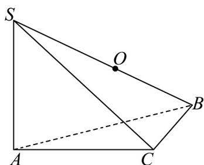

> [!faq]- 《专题19 空间直线、平面的垂直-线面垂直（高效培优期中专项训练）数学人教A版高一必修第二册》官方解析
>
> > [!success]- **【答案】** $\frac{52\sqrt{13}\pi}{3}$
>
> > [!note]- **【解析】**
> > 在VABC中，由余弦定理可得， $AC^{2}=AB^{2}+BC^{2}-2AB\cdot BC\cos60^{\circ}=16+4-2\times4\times2\times\frac{1}{2}=12$
> >
> > $$
> > A C = 2 \sqrt {3}
> > $$
> >
> > 则 $AC^2 + BC^2 = AB^2$ ，故 $\angle ACB = 90^\circ$ ，即 $AC \perp BC$
> >
> > 又 $SA \perp$ 平面 ABC，所以 $SA \perp BC$ ，
> >
> > 又 $SA \cap AC = A, SA, AC \subset$ 平面 $ABC$ ,
> >
> > 所以 $BC \perp$ 平面 ABC，所以 $BC \perp SC$ ，
> >
> > 所以 SB 的中点 O 到 S, A, B, C 四个点的距离相等，
> >
> > 即为三棱锥 S-ABC 外接球的球心，SB 为外接球直径，
> >
> > $$
> > 2 R = S B = \sqrt {S A ^ {2} + A B ^ {2}} = \sqrt {6 ^ {2} + 4 ^ {2}} = 2 \sqrt {1 3}, \text {故} R = \sqrt {1 3}
> > $$
> >
> > 则外接球的体积 $V = \frac{4\pi}{3} R^{3} = \frac{52\sqrt{13}\pi}{3}$ .
> >
> > 
> >
> > 故答案为： $\frac{52\sqrt{13}\pi}{3}$
