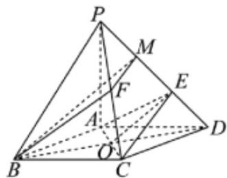

> [!faq]- 《专题19 空间直线、平面的垂直-线面垂直（高效培优期中专项训练）数学人教A版高一必修第二册》官方解析
>
> > [!success]- **【答案】** (1)证明见解析 (2) $\frac{\sqrt{5}}{5}$ . (3)证明见解析
>
> > [!note]- **【解析】**
> > （1）证明：设 AC 与 BD 的交点为 O，则 O 是 BD 的中点，
> >
> > 因为 $PB = PD$ ，所以 $PO \perp BD$
> >
> > 因为菱形 $ABCD$ ，所以 $AC \perp BD$
> >
> > 又 $PO \cap AC = O$ ， $PO$ 、 $AC \subset$ 平面 $PAC$ ，所以 $BD \perp$ 平面 $PAC$
> >
> > 又 $PC \subset$ 平面 PAC ，所以 $BD \perp PC$ .
> >
> > (2) 在菱形 ABCD 中， $\angle ABC = 60^{\circ}, AC = 1$
> >
> > 所以菱形的边长为 $^{1}$ ，且 $BD = \sqrt{3}, OD = \frac{1}{2} BD = \frac{\sqrt{3}}{2}$ ，
> >
> > 所以 $PO = \sqrt{PD^{2} - OD^{2}} = \sqrt{\left(\sqrt{2}\right)^{2} - \left(\frac{\sqrt{3}}{2}\right)^{2}} = \frac{\sqrt{5}}{2}$ ，
> >
> > 在 $\triangle PAO$ 中， $PA = 1,AO = \frac{1}{2},PO = \frac{\sqrt{5}}{2}$
> >
> > 所以 $PO^{2}=AO^{2}+PA^{2}$ ，即 $PA\perp AC$ ，
> >
> > 由（1）知 $BD \perp$ 平面 $PAC$
> >
> > 因为 $PA \subset$ 平面 PAC ，所以 $BD \perp PA$ ，
> >
> > 又 $AC \cap BD = O$ ，所以 $PA \perp$ 平面 ABCD，
> >
> > 所以 $V_{P-ABD}=\frac{1}{3}\cdot S_{\triangle ABD}PA=\frac{1}{3}\cdot\frac{1}{2}\cdot AB\cdot AD\cdot\sin120^{\circ}\cdot PA=\frac{1}{3}\times\frac{1}{2}\times1\times1\times\frac{\sqrt{3}}{2}\times1=\frac{\sqrt{3}}{12}$
> >
> > 设点 A 到平面 PBD 的距离为 d，
> >
> > 因为 $V_{A-PBD} = V_{P-ABD}$ ，
> >
> > 所以 $\frac{1}{3}\frac{1}{2} BD\text{PO}d = \frac{\sqrt{3}}{12}$ ，即 $\frac{1}{3} \times \frac{1}{2} \times \sqrt{3} \times \frac{\sqrt{5}}{2} \times d = \frac{\sqrt{3}}{12}$ ，解得 $d = \frac{\sqrt{5}}{5}$ ，
> >
> > 故点 A 到平面 PBD 的距离为 $\frac{\sqrt{5}}{5}$ .
> >
> > (3) 证明：取 $PE$ 的中点 $M$ ，连接 $FM, BM$ ，则 $FM // CE$ ，
> >
> > 因为 $CE \subset$ 平面 AEC ，FM $\notin$ 平面 AEC ，所以 FM // 平面 AEC ，
> >
> > 由 $PE:ED = 2:1$ ，知 $E$ 是MD的中点，
> >
> > 因为 O 是 BD 的中点，所以 BM // OE ，
> >
> > 因为 $OE \subset$ 平面 AEC， $BM \not\subset$ 平面 AEC，所以 $BM \parallel$ 平面 AEC
> >
> > 又 $FM \cap BM = M$ ， $FM$ 、 $BM \subset$ 平面 $BMF$
> >
> > 所以平面 $BMF / /$ 平面 $AEC$ ，又 $BF \subset$ 平面 $BMF$
> >
> > 所以 $BF / /$ 平面 $AEC$ .
> >
> > 
> >
> > 考点05求点面距离
