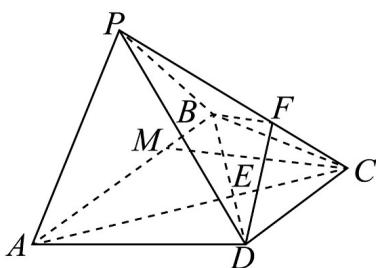

> [!faq]- 《专题19 空间直线、平面的垂直-线面垂直（高效培优期中专项训练）数学人教A版高一必修第二册》官方解析
>
> > [!success]- **【答案】** (1)证明见解析 (2) $2\sqrt{3}$
>
> > [!note]- **【解析】**
> > （1）证明：因为 $AB // CD$ ，且 $AB = 2CD$ ，可得 $\frac{CE}{AE} = \frac{CD}{AB} = \frac{1}{2}$
> >
> > 连接 $EF$ ，因为 $PF = 2FC$ ，所以 $\frac{FC}{PF} = \frac{1}{2} = \frac{CE}{AE}$ ，所以 $EF // PA$
> >
> > 又因为 $EF \subset$ 平面 $BDF$ ，且 $PA \notin$ 平面 $BDF$ ，所以 $PA //$ 平面 $BDF$ .
> >
> > (2) 解：因为 BC = DC = 6，AB = 2CD，所以 AB = 12，
> >
> > 又因为四边形 ABCD 是等腰梯形，AB // CD
> >
> > 在平面 $ABCD$ 中，作 $CM \perp AB$ 垂足为 $M$ ，则 $CM = \sqrt{BC^2 - BM^2} = \sqrt{6^2 - 3^2} = 3\sqrt{3}$
> >
> > 则 $\triangle BCD$ 的面积为 $S = \frac{1}{2} \times 6 \times 3\sqrt{3} = 9\sqrt{3}$
> >
> > 所以三棱锥 B-CDF 的体积为 $V=\frac{1}{3}S_{\triangle BCD}\cdot h=3\sqrt{3}h=6$ ，解得 $h=\frac{2\sqrt{3}}{3}$ ，
> >
> > 即点 $F$ 到平面ABCD的距离为 $\frac{2\sqrt{3}}{3}$
> >
> > 因为 PF = 2FC，所以点 P 到平面 ABCD 的距离是点 F 到平面 ABCD 的距离的 3 倍，
> > 所以点 P 到平面 ABCD 的距离为 $2\sqrt{3}$ .
> >
> > 
