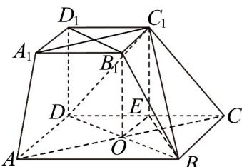
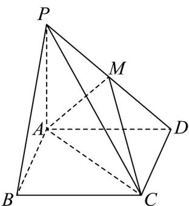
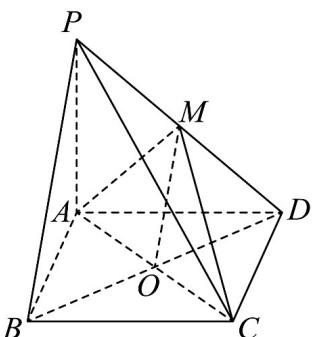

> [!faq]- 《专题19 空间直线、平面的垂直-线面垂直（高效培优期中专项训练）数学人教A版高一必修第二册》官方解析
>
> > [!success]- **【答案】** (1)证明见解析 (2) $\frac{4\sqrt{3}}{3}$ (3) $\frac{\sqrt{2}}{2}$
>
> > [!note]- **【解析】**
> > （1）连接 AC 交 BD 于 O，连接 $A_{1}C_{1}$ ，则 $AO=\frac{1}{2}AC$ ，
> >
> > 因为 $\frac{A_{1}B_{1}}{AB}=\frac{1}{2}$ ，由四棱台的性质可得 $A_{1}C_{1}//AO$ ，且 $A_{1}C_{1}=AO$ ，
> >
> > 故四边形 $A_{1}C_{1}OA$ 为平行四边形，故 $AA_{1}//C_{1}O$
> >
> > ∵ $AA_{1}$ 不包含于面 $BDC_{1}, C_{1}O \subset$ 面 $BDC_{1}$ ，故 $AA_{1} //$ 面 $BDC_{1}$ .
> >
> > (2) $\because AA_{1} // \text{面 } BDC_{1}$ , $\therefore$ 直线 $AA_{1}$ 到平面 $BDC_{1}$ 的距离等价于点 $A$ 到平面 $BDC_{1}$ 的距离,
> >
> > $$
> > \therefore V _ {A - B D C _ {1}} = V _ {C _ {1} - A B D} = \frac {1}{3} S _ {\triangle B D C _ {1}} \cdot d _ {A - B D C _ {1}} = \frac {1}{3} S _ {\triangle A B D} \cdot d _ {C _ {1} - A B D}
> > $$
> >
> > $$
> > S _ {\triangle A B D} = 8, d _ {C _ {1} - A B D} = D D _ {1} = 2, D C _ {1} = 2 \sqrt {2}, D B = 4 \sqrt {2}
> > $$
> >
> > 取 $DC$ 中点 $E$ ，连 $C_1E$ ， $EB$ ，可得 $C_1E // DD_1, C_1E = DD_1 = 2$ ，而 $D_1D \perp$ 平面 $ABCD$ ，
> >
> > 故 $C_{1}E \perp$ 平面ABCD，由 $BE \subset$ 平面ABCD，故 $C_{1}E \perp BE$
> >
> > $\because BE = 2\sqrt{5}$ ，得 $C_1B = \sqrt{4 + 20} = 2\sqrt{6}$
> >
> > $\therefore C_{1}B^{2} + C_{1}D^{2} = BD^{2}$ ， $DC_{1}\perp BC_{1}$ ，故 $S_{\triangle BDC_1} = \frac{1}{2}\times 2\sqrt{2}\times 2\sqrt{6} = 4\sqrt{3}$
> >
> > 故 $\frac{1}{3} \times 4\sqrt{3} \cdot d_{A - BDC_1} = \frac{1}{3} \times 8 \times 2$ ，故 $d_{A - BDC_1} = \frac{4\sqrt{3}}{3}$
> >
> > (3)
> >
> > 
> >
> > 连接 $B_{1}D_{1}, B_{1}O$ ，因为 $\frac{A_{1}B_{1}}{AB} = \frac{1}{2}$ ，由四棱台的性质可得 $B_{1}D_{1} // DO, B_{1}D_{1} = DO$ ，
> >
> > 故四边形 $D_{1}B_{1}OD$ 为平行四边形，故 $B_{1}O//DD_{1}$ ，故 $B_{1}O \perp$ 平面ABCD
> >
> > 而 $BD \subset$ 平面 $ABCD$ ，故 $B_{1}O \perp BD$ ，又 $BD \perp AC$ ， $B_{1}O \cap AC = O$
> >
> > $B_{1}O, AC \subset$ 平面 $ACB_{1}$ ，故 $BD \perp$ 平面 $B_{1}AC$ ，
> >
> > ∵ $BD \perp B_{1}P$ ，点 P 在面 ABCD 内的动点，∴ 点 $P \in$ 面 $ABCD \cap$ 面 $ACB_{1} = AC$
> >
> > $QDD_{1}\perp$ 面ABCD， $\therefore\angle D_{1}PD$ 为 $D_{1}P$ 与面ABCD所成的平面角，
> >
> > $\therefore \tan \angle D_{1}PD = \frac{DD_{1}}{DO} = \frac{2}{DO}$ ， $DO$ 最小为 $2\sqrt{2}$ ，则 $\tan \angle D_1PD$ 最大为 $\frac{\sqrt{2}}{2}$
> >
> > 27. 四棱锥 $P - ABCD$ 的底面 $ABCD$ 是边长为 3 的正方形， $M$ 是 $PD$ 的中点，
> >
> > 
> >
> > (1)证明： $PB / /$ 平面MAC；
> >
> > (2)若 $M$ 在底面ABCD上的投影为底面中心，求直线BP到平面MAC的距离.
> >
> > 【答案】(1)证明见解析
> >
> > (2) $\frac{3\sqrt{2}}{2}$
> >
> > 【详解】（1）证明：连接 BD 交 AC 于点 O，连接 OM
> >
> > 因为四边形 ABCD 是正方形，所以 O 是 BD 的中点
> >
> > 因为 $M$ 是 $PD$ 的中点，所以 $OM \parallel PB$
> >
> > 又因为 $OM \subset$ 平面 $MAC$ ， $PB \notin$ 平面 $MAC$
> >
> > 所以 $PB / /$ 平面MAC；
> >
> > 
> >
> > (2) 因为 $M$ 在底面 $ABCD$ 上的投影为底面中心，所以 $MO \perp$ 平面 $ABCD$
> >
> > 因为 $BD \subset$ 平面 $ABCD$ ，所以 $MO \perp BD$
> >
> > 由 $(1)$ 知， $PB//$ 平面MAC，
> >
> > 所以直线 BP 到平面 MAC 的距离等于点 B 到平面 MAC 的距离
> >
> > 因为 $ABCD$ 为正方形，所以 $BD \perp AC$
> >
> > 因为 $AC \subset$ 平面 $MAC$ ， $MO \subset$ 平面 $MAC$ ， $AC \cap MO = O$
> >
> > 所以 $BD \perp$ 平面 $MAC$
> >
> > 所以点 B 到平面 MAC 的距离即线段 BO 的长度
> >
> > 在正方形 ABCD 中，AB = BC = 3
> >
> > 所以 $BO = \frac{1}{2} BD = \frac{1}{2}\times 3\sqrt{2} = \frac{3\sqrt{2}}{2}$ ，所以直线 $BP$ 到平面 $MAC$ 的距离为 $\frac{3\sqrt{2}}{2}$
