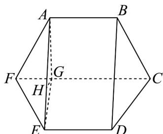

> [!faq]- 《专题19 空间直线、平面的垂直-线面垂直（高效培优期中专项训练）数学人教A版高一必修第二册》官方解析
>
> > [!success]- **【答案】** (1)证明见解析 (2) $\theta = 120^{\circ}$ (3) $\frac{3\sqrt{7}}{2} + 6\sqrt{3} + 6$
>
> > [!note]- **【解析】**
> > （1）在正六边形 $ABCDEF$ 中， $CF // AB$
> >
> > 折起后，在多面体 $AB - CDEF$ 中，同样也有 $CF / / AB$
> >
> > 又 $CF \notin$ 平面 $ABDE$ ， $AB \subset$ 平面 $ABDE$
> >
> > 所以 $CF \parallel$ 平面 $ABDE$ .
> >
> > (2) 如图所示，作 $AG \perp CF$ ，垂足为 $G$ ，连接 $EG$
> >
> > $\angle AFC = \angle EFC = 60^{\circ}$ ， $AG = EG = EF\sin 60^{\circ} = 2\times \frac{\sqrt{3}}{2} = \sqrt{3}$
> >
> > $$
> > F G = E F \cos 6 0 ^ {\circ} = 2 \times \frac {1}{2} = 1
> > $$
> >
> > 在 $\triangle EFG$ 中，由余弦定理得 $\cos \angle EFG = \frac{1^2 + 2^2 - EG^2}{2 \times 1 \times 2} = \frac{1}{2}$ ，解得 $EG = \sqrt{3}$ ，
> >
> > 则 $FG^{2} + EG^{2} = 1^{2} + \left(\sqrt{3}\right)^{2} = 2^{2} = EF^{2}$ ，所以 $FG\perp EG$ ，即 $CF\perp EG$ ，
> >
> > 所以 $\angle AGE$ 是平面 $ABCF$ 与平面 $EDCF$ 所成的角，则 $\angle AGE = \theta$
> >
> > 因为 $AG \perp CF$ ， $CF \perp EG$ ， $AG \cap EG = G$ ， $AG, EG \subset$ 平面 AEG，
> >
> > 所以 $CF \perp$ 平面 $AEG$ ，又 $CF // DE$ ，所以 $DE \perp$ 平面 $AEG$
> >
> > 如图，作 $GH \perp AE$ 垂足为 H，则 $GH \not\perp$ 平面 AEG， $DE \perp GH$ ，
> >
> > 因为 $AE \cap DE = E$ ， $AE, DE \subset$ 平面 ABDE，所以 $GH \perp$ 平面 ABDE，
> >
> > 所以 $GH$ 是点 $G$ 到平面 $ABDE$ 的距离，也是直线 $CF$ 到平面 $ABDE$ 的距离，
> >
> > 即 $GH = \frac{\sqrt{3}}{2}$ ，因为 $AG = EG$ ，所以 $\angle EGH = \frac{\theta}{2}$
> >
> > $GH = EG \cos \frac{\theta}{2} = \sqrt{3} \cos \frac{\theta}{2} = \frac{\sqrt{3}}{2}$ ，解得 $\frac{\theta}{2} = 60^{\circ}$ ，所以 $\theta = 120^{\circ}$ .
> >
> > 故当 $\theta=120^{\circ}$ 时，直线 CF 到平面 ABDE 的距离等于 $\frac{\sqrt{3}}{2}$ .
> >
> > 
> >
> > (3) 由 (2) 得 $\theta = 120^{\circ}$ , 在 $\triangle AGE$ 中,
> >
> > 由余弦定理得 $\cos\angle AGE=\frac{\left(\sqrt{3}\right)^{2}+\left(\sqrt{3}\right)^{2}-AE^{2}}{2\times\sqrt{3}\times\sqrt{3}}=-\frac{1}{2}$ ，所以 AE=3，
> >
> > 在 $\triangle AEF$ 中，由余弦定理得 $\cos \angle AFE = \frac{2^2 + 2^2 - 3^2}{2 \times 2 \times 2} = -\frac{1}{8}$
> >
> > 则 $\sin \angle AFE = \sqrt{1 - \left(-\frac{1}{8}\right)^2} = \frac{3\sqrt{7}}{8}$
> >
> > 因为 $CF \perp$ 平面 AEG ， $AE \subset$ 平面 AEG ，所以 $CF \perp AE$
> >
> > 又因为 $CF \parallel AB$ ，所以 $AB \perp AE$
> >
> > 又 $AB // DE$ ， $AB = DE$ ，所以四边形 $ABDE$ 是矩形，
> >
> > $$
> > S _ {\triangle B C D} = S _ {\triangle A F E} = \frac {1}{2} A F \cdot E F \cdot \sin \angle A F E = \frac {1}{2} \times 2 \times 2 \times \frac {3 \sqrt {7}}{8} = \frac {3 \sqrt {7}}{4}
> > $$
> >
> > $$
> > S _ {\text {梯形} A B C F} = S _ {\text {梯形} E D C F} = \frac {2 + 4}{2} \times \sqrt {3} = 3 \sqrt {3}, S _ {\text {矩形} A B D E} = 2 \times 3 = 6
> > $$
> >
> > 故 $S_{\text{多面体}AB - CDEF} = S_{\triangle BCD} + S_{\triangle AFE} + S_{\text{梯形}ABCF} + S_{\text{梯形}EDCF} + S_{\text{矩形}ABDE}$
> >
> > $$
> > = \frac {3 \sqrt {7}}{4} + \frac {3 \sqrt {7}}{4} + 3 \sqrt {3} + 3 \sqrt {3} + 6 = \frac {3 \sqrt {7}}{2} + 6 \sqrt {3} + 6.
> > $$
